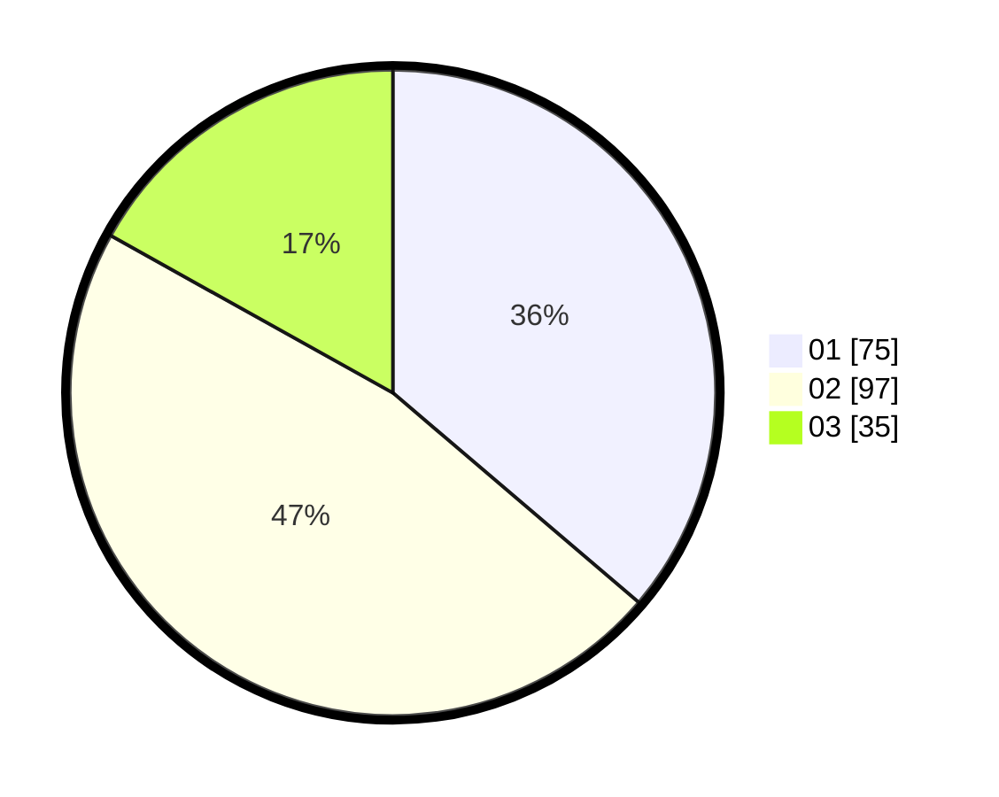

# Hasil

Hasil perolehan suara paslon dapat dilihat pada file paslon-01.txt, paslon-02.txt, dan paslon-03.txt.

Jika tidak ada, artinya data tersebut belum ada pada SIREKAP.

## Perolehan Suara

 * Paslon 01: **75**.
 * Paslon 02: **97**.
 * Paslon 03: **35**.

## Foto C Plano

https://sirekap-obj-formc.kpu.go.id/20dc/pemilu/ppwp/31/74/07/10/03/3174071003015-20240218-162441--0769329b-1a31-459c-ac4c-0749d3417c2e.jpg

https://sirekap-obj-formc.kpu.go.id/20dc/pemilu/ppwp/31/74/07/10/03/3174071003015-20240218-162749--b489ce03-7e32-408b-a95e-a3f72c9e7e7c.jpg

https://sirekap-obj-formc.kpu.go.id/20dc/pemilu/ppwp/31/74/07/10/03/3174071003015-20240218-162838--d67cafc0-edf2-4a2b-9afc-0bdf5d260c8b.jpg

## DATA PEMILIH TETAP

Jumlah pemilih dalam DPT: **268**.
 * L: **142**.
 * P: **126**.

## DATA PENGGUNA HAK PILIH

Jumlah pengguna hak pilih dalam DPT: **198**.
 * L: **104**.
 * P: **94**.

Jumlah pengguna hak pilih dalam DPTb: **8**.
 * L: **5**.
 * P: **3**.

Jumlah pengguna hak pilih dalam DPK: **2**.
 * L: **1**.
 * P: **1**.

Jumlah pengguna hak pilih: **208**.
 * L: **110**.
 * P: **98**.

## JUMLAH SUARA SAH DAN TIDAK SAH

JUMLAH SELURUH SUARA SAH: **207**.

JUMLAH SUARA TIDAK SAH: **1**.

JUMLAH SELURUH SUARA SAH DAN SUARA TIDAK SAH: **208**.
