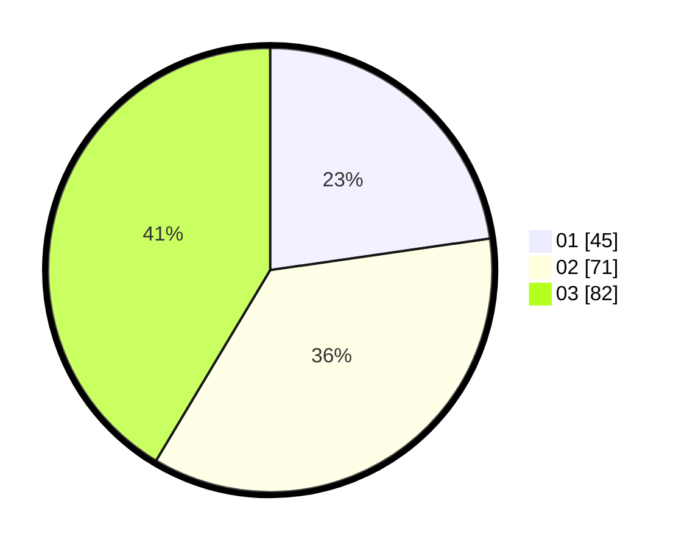

# Hasil

Hasil perolehan suara paslon dapat dilihat pada file paslon-01.txt, paslon-02.txt, dan paslon-03.txt.

Jika tidak ada, artinya data tersebut belum ada pada SIREKAP.

## Perolehan Suara

 * Paslon 01: **45**.
 * Paslon 02: **71**.
 * Paslon 03: **82**.

## Foto C Plano

https://sirekap-obj-formc.kpu.go.id/50c3/pemilu/ppwp/31/74/07/10/03/3174071003017-20240219-121834--19feb785-dc43-4969-aa67-73966ef9ea96.jpg

https://sirekap-obj-formc.kpu.go.id/50c3/pemilu/ppwp/31/74/07/10/03/3174071003017-20240219-121942--ff9c4f22-27af-49db-88c5-6b6879a043d0.jpg

https://sirekap-obj-formc.kpu.go.id/50c3/pemilu/ppwp/31/74/07/10/03/3174071003017-20240219-122406--5bb1a930-9ea0-4530-8d0f-b8d0a446c389.jpg
