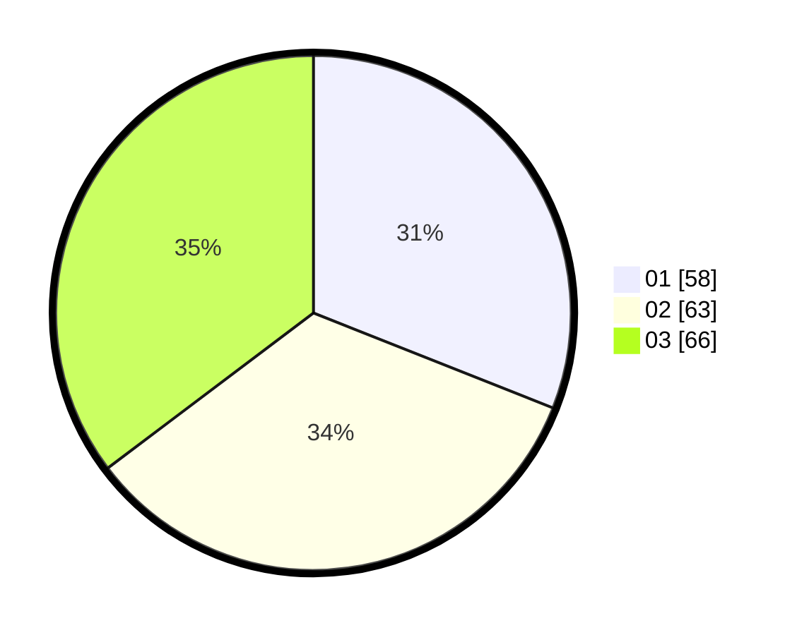

# Hasil

Hasil perolehan suara paslon dapat dilihat pada file paslon-01.txt, paslon-02.txt, dan paslon-03.txt.

Jika tidak ada, artinya data tersebut belum ada pada SIREKAP.

## Perolehan Suara

 * Paslon 01: **58**.
 * Paslon 02: **63**.
 * Paslon 03: **66**.

## Foto C Plano

https://sirekap-obj-formc.kpu.go.id/1ec3/pemilu/ppwp/31/74/07/10/03/3174071003018-20240214-190622--bfeeefd3-6336-4d97-bddc-a36fa65d3867.jpg

https://sirekap-obj-formc.kpu.go.id/1ec3/pemilu/ppwp/31/74/07/10/03/3174071003018-20240214-191642--5529a133-15e7-4061-96d9-f2295ba17485.jpg

https://sirekap-obj-formc.kpu.go.id/1ec3/pemilu/ppwp/31/74/07/10/03/3174071003018-20240214-204534--b76c4f5f-8c1a-4560-9b10-84f9b51b724f.jpg

## DATA PEMILIH TETAP

Jumlah pemilih dalam DPT: **228**.
 * L: **102**.
 * P: **126**.

## DATA PENGGUNA HAK PILIH

Jumlah pengguna hak pilih dalam DPT: **166**.
 * L: **79**.
 * P: **87**.

Jumlah pengguna hak pilih dalam DPTb: **21**.
 * L: **11**.
 * P: **10**.

Jumlah pengguna hak pilih dalam DPK: **2**.
 * L: **2**.
 * P: **0**.

Jumlah pengguna hak pilih: **189**.
 * L: **92**.
 * P: **97**.

## JUMLAH SUARA SAH DAN TIDAK SAH

JUMLAH SELURUH SUARA SAH: **187**.

JUMLAH SUARA TIDAK SAH: **2**.

JUMLAH SELURUH SUARA SAH DAN SUARA TIDAK SAH: **189**.
