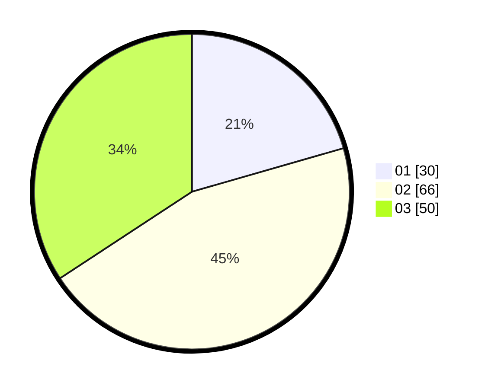

# Hasil

Hasil perolehan suara paslon dapat dilihat pada file paslon-01.txt, paslon-02.txt, dan paslon-03.txt.

Jika tidak ada, artinya data tersebut belum ada pada SIREKAP.

## Perolehan Suara

 * Paslon 01: **30**.
 * Paslon 02: **66**.
 * Paslon 03: **50**.

## Foto C Plano

https://sirekap-obj-formc.kpu.go.id/1f9f/pemilu/ppwp/31/74/07/10/03/3174071003019-20240214-155050--8f01bb05-5487-458c-a528-ca9d6c936eeb.jpg

https://sirekap-obj-formc.kpu.go.id/1f9f/pemilu/ppwp/31/74/07/10/03/3174071003019-20240214-155219--7aa8b750-8571-4ede-9690-11e532d3ca71.jpg

https://sirekap-obj-formc.kpu.go.id/1f9f/pemilu/ppwp/31/74/07/10/03/3174071003019-20240214-155338--1c3e12c9-0c09-4884-abde-5bad1c9459f3.jpg

## DATA PEMILIH TETAP

Jumlah pemilih dalam DPT: **167**.
 * L: **76**.
 * P: **91**.

## DATA PENGGUNA HAK PILIH

Jumlah pengguna hak pilih dalam DPT: **138**.
 * L: **64**.
 * P: **74**.

Jumlah pengguna hak pilih dalam DPTb: **8**.
 * L: **4**.
 * P: **4**.

Jumlah pengguna hak pilih dalam DPK: **0**.
 * L: **0**.
 * P: **0**.

Jumlah pengguna hak pilih: **146**.
 * L: **68**.
 * P: **78**.

## JUMLAH SUARA SAH DAN TIDAK SAH

JUMLAH SELURUH SUARA SAH: **146**.

JUMLAH SUARA TIDAK SAH: **0**.

JUMLAH SELURUH SUARA SAH DAN SUARA TIDAK SAH: **146**.
