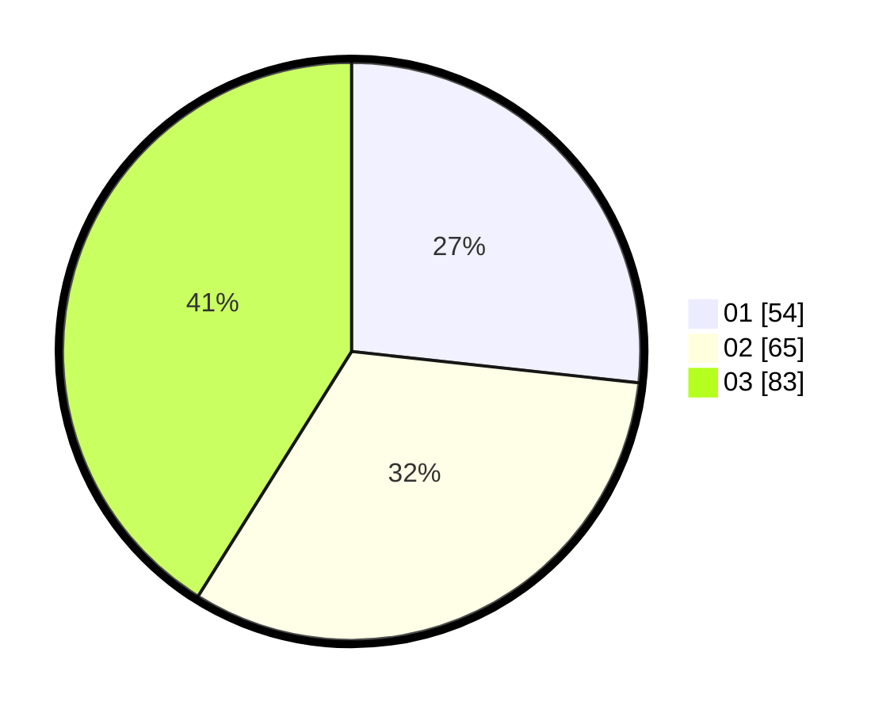

# Hasil

Hasil perolehan suara paslon dapat dilihat pada file paslon-01.txt, paslon-02.txt, dan paslon-03.txt.

Jika tidak ada, artinya data tersebut belum ada pada SIREKAP.

## Perolehan Suara

 * Paslon 01: **54**.
 * Paslon 02: **65**.
 * Paslon 03: **83**.

## Foto C Plano

https://sirekap-obj-formc.kpu.go.id/5f2b/pemilu/ppwp/31/74/07/10/03/3174071003022-20240218-200943--e751b049-1d97-4a75-b051-57b30ed5e0ec.jpg

https://sirekap-obj-formc.kpu.go.id/5f2b/pemilu/ppwp/31/74/07/10/03/3174071003022-20240218-201306--0f627682-31e4-40e3-ae16-51be89a7f2ae.jpg

https://sirekap-obj-formc.kpu.go.id/5f2b/pemilu/ppwp/31/74/07/10/03/3174071003022-20240218-201633--f18f4276-b7dd-4333-87cf-c47ce698efbb.jpg

## DATA PEMILIH TETAP

Jumlah pemilih dalam DPT: **248**.
 * L: **112**.
 * P: **136**.

## DATA PENGGUNA HAK PILIH

Jumlah pengguna hak pilih dalam DPT: **184**.
 * L: **82**.
 * P: **102**.

Jumlah pengguna hak pilih dalam DPTb: **19**.
 * L: **10**.
 * P: **9**.

Jumlah pengguna hak pilih dalam DPK: **3**.
 * L: **1**.
 * P: **2**.

Jumlah pengguna hak pilih: **206**.
 * L: **93**.
 * P: **113**.

## JUMLAH SUARA SAH DAN TIDAK SAH

JUMLAH SELURUH SUARA SAH: **202**.

JUMLAH SUARA TIDAK SAH: **4**.

JUMLAH SELURUH SUARA SAH DAN SUARA TIDAK SAH: **206**.
