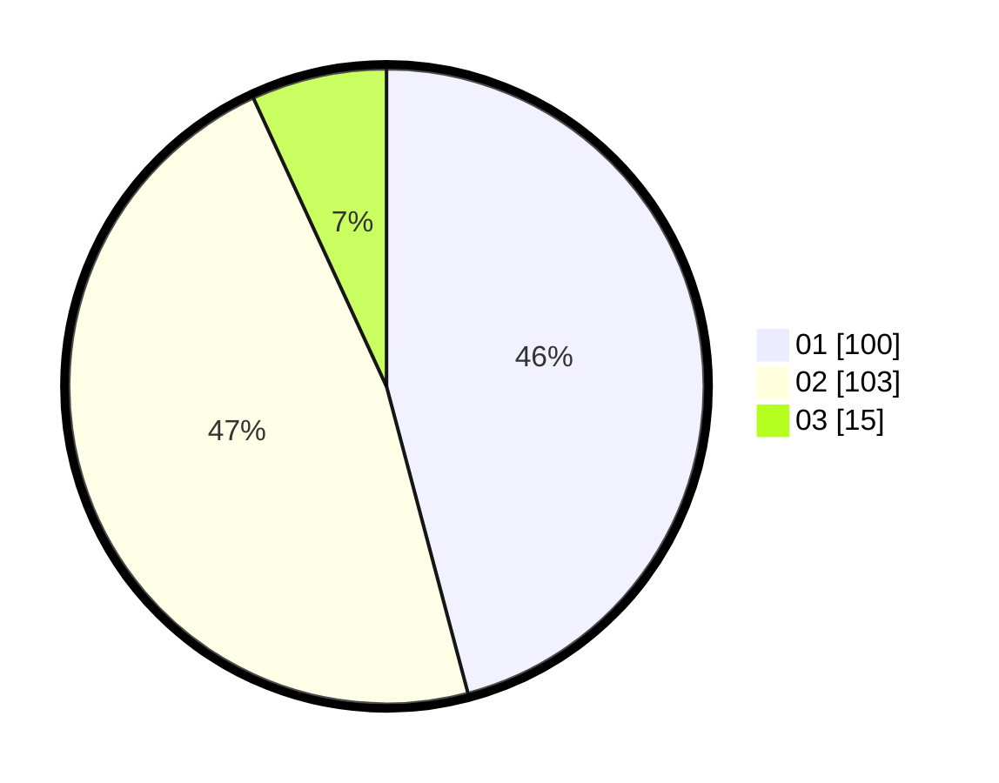

# Hasil

Hasil perolehan suara paslon dapat dilihat pada file paslon-01.txt, paslon-02.txt, dan paslon-03.txt.

Jika tidak ada, artinya data tersebut belum ada pada SIREKAP.

## Perolehan Suara

 * Paslon 01: **100**.
 * Paslon 02: **103**.
 * Paslon 03: **15**.

## Foto C Plano

https://sirekap-obj-formc.kpu.go.id/8e05/pemilu/ppwp/31/74/07/10/03/3174071003024-20240218-200817--7252a889-3982-4ac2-b731-6402ea61923e.jpg

https://sirekap-obj-formc.kpu.go.id/8e05/pemilu/ppwp/31/74/07/10/03/3174071003024-20240218-201248--32c5c1bc-7a0d-4a2d-862e-abdbd5149002.jpg

https://sirekap-obj-formc.kpu.go.id/8e05/pemilu/ppwp/31/74/07/10/03/3174071003024-20240218-201400--c964682a-2e82-413e-a6cc-aba91a8b872d.jpg

## DATA PEMILIH TETAP

Jumlah pemilih dalam DPT: **284**.
 * L: **145**.
 * P: **139**.

## DATA PENGGUNA HAK PILIH

Jumlah pengguna hak pilih dalam DPT: **207**.
 * L: **106**.
 * P: **101**.

Jumlah pengguna hak pilih dalam DPTb: **10**.
 * L: **7**.
 * P: **3**.

Jumlah pengguna hak pilih dalam DPK: **6**.
 * L: **3**.
 * P: **3**.

Jumlah pengguna hak pilih: **223**.
 * L: **116**.
 * P: **107**.

## JUMLAH SUARA SAH DAN TIDAK SAH

JUMLAH SELURUH SUARA SAH: **218**.

JUMLAH SUARA TIDAK SAH: **5**.

JUMLAH SELURUH SUARA SAH DAN SUARA TIDAK SAH: **223**.
