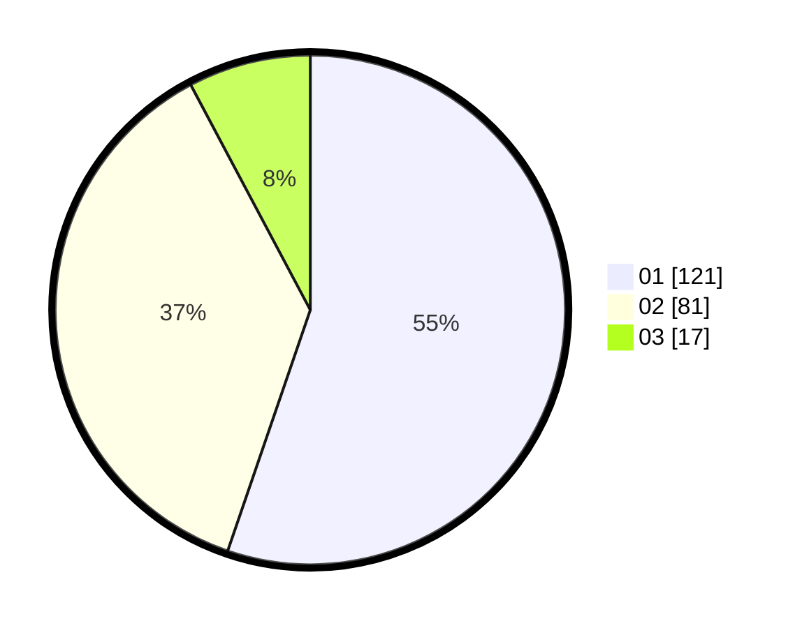

# Hasil

Hasil perolehan suara paslon dapat dilihat pada file paslon-01.txt, paslon-02.txt, dan paslon-03.txt.

Jika tidak ada, artinya data tersebut belum ada pada SIREKAP.

## Perolehan Suara

 * Paslon 01: **121**.
 * Paslon 02: **81**.
 * Paslon 03: **17**.

## Foto C Plano

https://sirekap-obj-formc.kpu.go.id/c0df/pemilu/ppwp/31/74/07/10/03/3174071003025-20240218-195140--45c1e6b0-88aa-47ff-9882-a37485044f14.jpg

https://sirekap-obj-formc.kpu.go.id/c0df/pemilu/ppwp/31/74/07/10/03/3174071003025-20240218-200614--29237bb4-4279-4909-a6be-46a2f4f2ba4b.jpg

https://sirekap-obj-formc.kpu.go.id/c0df/pemilu/ppwp/31/74/07/10/03/3174071003025-20240218-200827--0f6d1d17-ae39-464b-843f-9c302054434c.jpg

## DATA PEMILIH TETAP

Jumlah pemilih dalam DPT: **278**.
 * L: **142**.
 * P: **136**.

## DATA PENGGUNA HAK PILIH

Jumlah pengguna hak pilih dalam DPT: **217**.
 * L: **101**.
 * P: **116**.

Jumlah pengguna hak pilih dalam DPTb: **7**.
 * L: **7**.
 * P: **0**.

Jumlah pengguna hak pilih dalam DPK: **0**.
 * L: **0**.
 * P: **0**.

Jumlah pengguna hak pilih: **224**.
 * L: **108**.
 * P: **116**.

## JUMLAH SUARA SAH DAN TIDAK SAH

JUMLAH SELURUH SUARA SAH: **219**.

JUMLAH SUARA TIDAK SAH: **5**.

JUMLAH SELURUH SUARA SAH DAN SUARA TIDAK SAH: **224**.
