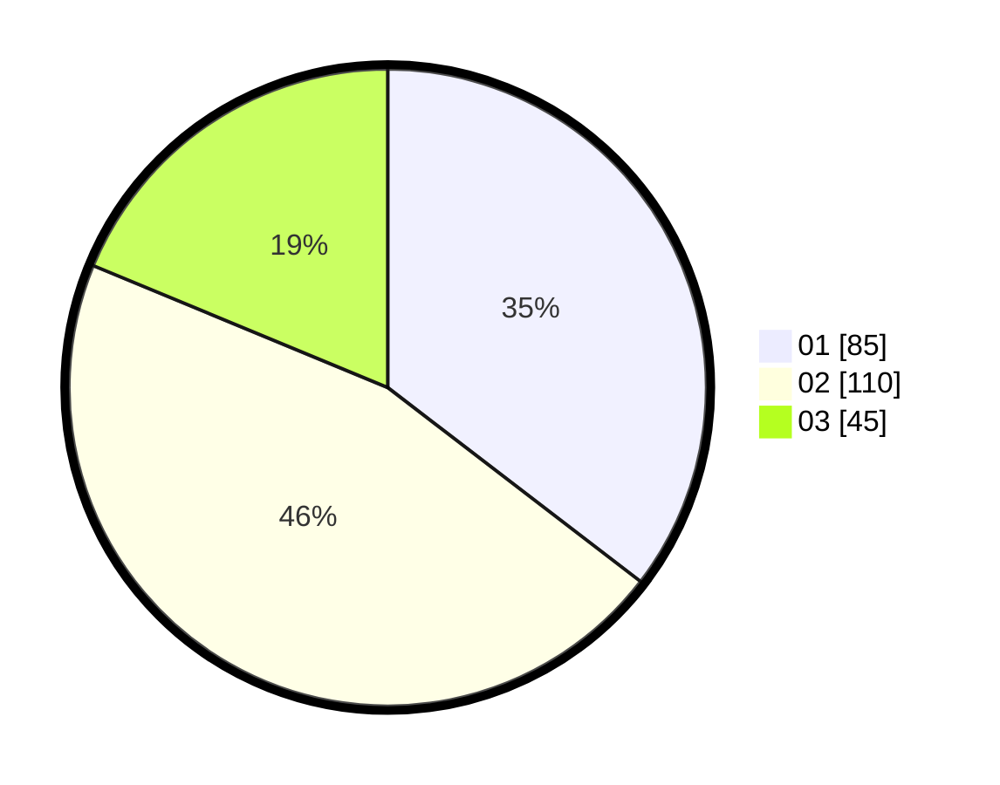

# Hasil

Hasil perolehan suara paslon dapat dilihat pada file paslon-01.txt, paslon-02.txt, dan paslon-03.txt.

Jika tidak ada, artinya data tersebut belum ada pada SIREKAP.

## Perolehan Suara

 * Paslon 01: **85**.
 * Paslon 02: **110**.
 * Paslon 03: **45**.

## Foto C Plano

https://sirekap-obj-formc.kpu.go.id/ca97/pemilu/ppwp/31/74/07/10/03/3174071003026-20240214-225853--24365034-74f4-4f5a-9c6b-217a341fae2b.jpg

https://sirekap-obj-formc.kpu.go.id/ca97/pemilu/ppwp/31/74/07/10/03/3174071003026-20240214-230101--0b171d2e-d5c2-415c-be5d-28775737e4b3.jpg

https://sirekap-obj-formc.kpu.go.id/ca97/pemilu/ppwp/31/74/07/10/03/3174071003026-20240214-230158--fd0d8aec-4658-4003-93dd-b654e7c43790.jpg

## DATA PEMILIH TETAP

Jumlah pemilih dalam DPT: **291**.
 * L: **153**.
 * P: **138**.

## DATA PENGGUNA HAK PILIH

Jumlah pengguna hak pilih dalam DPT: **240**.
 * L: **120**.
 * P: **120**.

Jumlah pengguna hak pilih dalam DPTb: **8**.
 * L: **6**.
 * P: **2**.

Jumlah pengguna hak pilih dalam DPK: **0**.
 * L: **0**.
 * P: **0**.

Jumlah pengguna hak pilih: **248**.
 * L: **126**.
 * P: **122**.

## JUMLAH SUARA SAH DAN TIDAK SAH

JUMLAH SELURUH SUARA SAH: **240**.

JUMLAH SUARA TIDAK SAH: **8**.

JUMLAH SELURUH SUARA SAH DAN SUARA TIDAK SAH: **248**.
