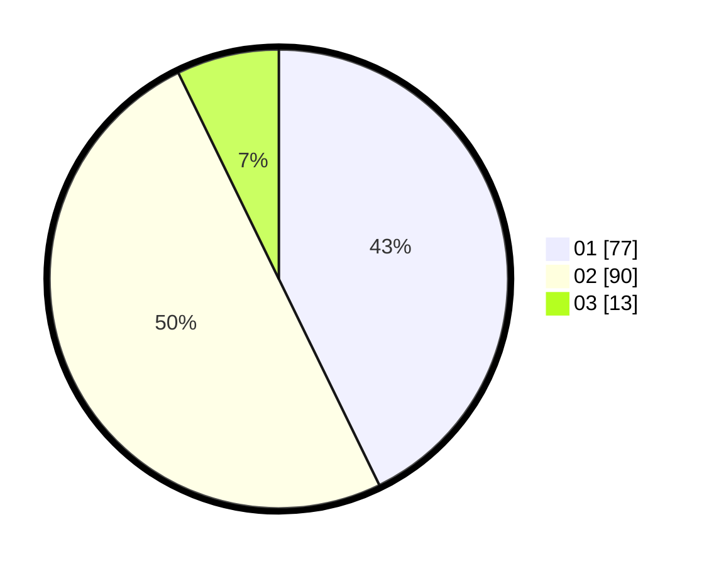

# Hasil

Hasil perolehan suara paslon dapat dilihat pada file paslon-01.txt, paslon-02.txt, dan paslon-03.txt.

Jika tidak ada, artinya data tersebut belum ada pada SIREKAP.

## Perolehan Suara

 * Paslon 01: **77**.
 * Paslon 02: **90**.
 * Paslon 03: **13**.

## Foto C Plano

https://sirekap-obj-formc.kpu.go.id/4918/pemilu/ppwp/31/74/07/10/03/3174071003027-20240218-192110--f8e469a6-4221-4c7d-9f10-30f606e490a2.jpg

https://sirekap-obj-formc.kpu.go.id/4918/pemilu/ppwp/31/74/07/10/03/3174071003027-20240218-193205--630b7851-577d-48b6-8150-a3f3a4491fce.jpg

https://sirekap-obj-formc.kpu.go.id/4918/pemilu/ppwp/31/74/07/10/03/3174071003027-20240218-193642--7859a805-5021-4972-bbae-11918c84a23d.jpg

## DATA PEMILIH TETAP

Jumlah pemilih dalam DPT: **217**.
 * L: **115**.
 * P: **102**.

## DATA PENGGUNA HAK PILIH

Jumlah pengguna hak pilih dalam DPT: **180**.
 * L: **93**.
 * P: **87**.

Jumlah pengguna hak pilih dalam DPTb: **1**.
 * L: **1**.
 * P: **0**.

Jumlah pengguna hak pilih dalam DPK: **1**.
 * L: **0**.
 * P: **1**.

Jumlah pengguna hak pilih: **182**.
 * L: **94**.
 * P: **88**.

## JUMLAH SUARA SAH DAN TIDAK SAH

JUMLAH SELURUH SUARA SAH: **180**.

JUMLAH SUARA TIDAK SAH: **2**.

JUMLAH SELURUH SUARA SAH DAN SUARA TIDAK SAH: **182**.
