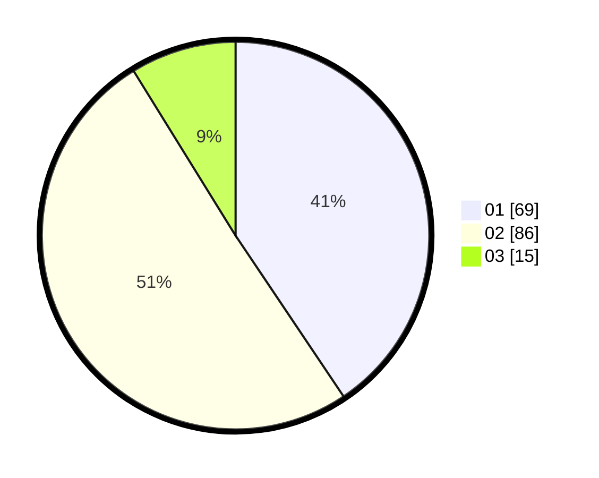

# Hasil

Hasil perolehan suara paslon dapat dilihat pada file paslon-01.txt, paslon-02.txt, dan paslon-03.txt.

Jika tidak ada, artinya data tersebut belum ada pada SIREKAP.

## Perolehan Suara

 * Paslon 01: **69**.
 * Paslon 02: **86**.
 * Paslon 03: **15**.

## Foto C Plano

https://sirekap-obj-formc.kpu.go.id/bedb/pemilu/ppwp/31/74/07/10/03/3174071003028-20240218-205826--1dda161b-c5e1-4507-97df-bb0c26f14084.jpg

https://sirekap-obj-formc.kpu.go.id/bedb/pemilu/ppwp/31/74/07/10/03/3174071003028-20240218-205516--768fae1e-b40d-4127-b649-cc33c55aa6b5.jpg

https://sirekap-obj-formc.kpu.go.id/bedb/pemilu/ppwp/31/74/07/10/03/3174071003028-20240218-205202--cb66c7e6-5b72-4192-b66b-1d3f1b2b340f.jpg

## DATA PEMILIH TETAP

Jumlah pemilih dalam DPT: **211**.
 * L: **110**.
 * P: **101**.

## DATA PENGGUNA HAK PILIH

Jumlah pengguna hak pilih dalam DPT: **172**.
 * L: **88**.
 * P: **84**.

Jumlah pengguna hak pilih dalam DPTb: **2**.
 * L: **1**.
 * P: **1**.

Jumlah pengguna hak pilih dalam DPK: **1**.
 * L: **0**.
 * P: **1**.

Jumlah pengguna hak pilih: **175**.
 * L: **89**.
 * P: **86**.

## JUMLAH SUARA SAH DAN TIDAK SAH

JUMLAH SELURUH SUARA SAH: **170**.

JUMLAH SUARA TIDAK SAH: **5**.

JUMLAH SELURUH SUARA SAH DAN SUARA TIDAK SAH: **175**.
