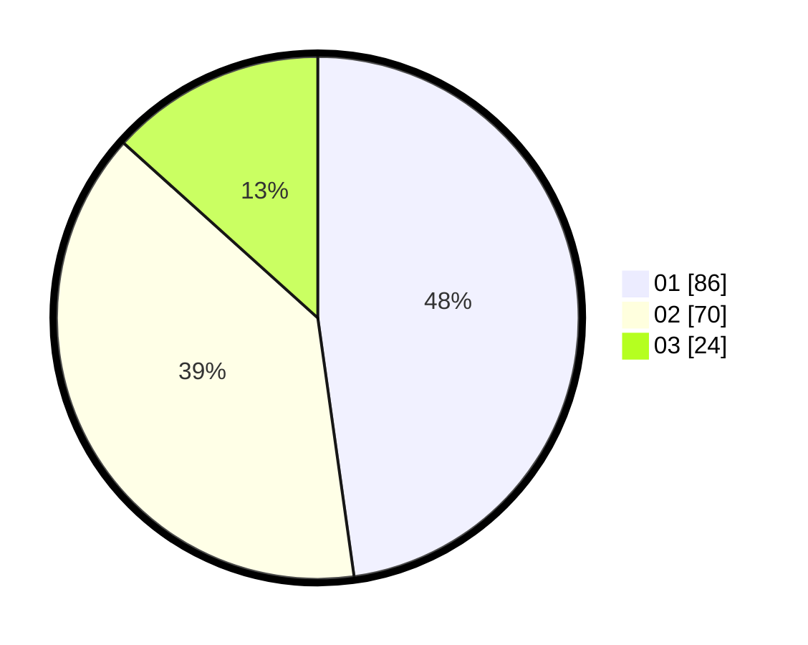

# Hasil

Hasil perolehan suara paslon dapat dilihat pada file paslon-01.txt, paslon-02.txt, dan paslon-03.txt.

Jika tidak ada, artinya data tersebut belum ada pada SIREKAP.

## Perolehan Suara

 * Paslon 01: **86**.
 * Paslon 02: **70**.
 * Paslon 03: **24**.

## Foto C Plano

https://sirekap-obj-formc.kpu.go.id/e16b/pemilu/ppwp/31/74/07/10/03/3174071003030-20240214-184514--94cf5c93-f608-48e5-9d1d-dfbeddbb9ee0.jpg

https://sirekap-obj-formc.kpu.go.id/e16b/pemilu/ppwp/31/74/07/10/03/3174071003030-20240214-184541--5b5b5b24-c41a-4c13-bac0-0f353dfaed52.jpg

https://sirekap-obj-formc.kpu.go.id/e16b/pemilu/ppwp/31/74/07/10/03/3174071003030-20240214-184658--81b71da7-e972-4729-8fbf-bc0c39426b9d.jpg

## DATA PEMILIH TETAP

Jumlah pemilih dalam DPT: **210**.
 * L: **102**.
 * P: **108**.

## DATA PENGGUNA HAK PILIH

Jumlah pengguna hak pilih dalam DPT: **180**.
 * L: **85**.
 * P: **95**.

Jumlah pengguna hak pilih dalam DPTb: **2**.
 * L: **0**.
 * P: **2**.

Jumlah pengguna hak pilih dalam DPK: **0**.
 * L: **0**.
 * P: **0**.

Jumlah pengguna hak pilih: **182**.
 * L: **85**.
 * P: **97**.

## JUMLAH SUARA SAH DAN TIDAK SAH

JUMLAH SELURUH SUARA SAH: **180**.

JUMLAH SUARA TIDAK SAH: **2**.

JUMLAH SELURUH SUARA SAH DAN SUARA TIDAK SAH: **182**.
