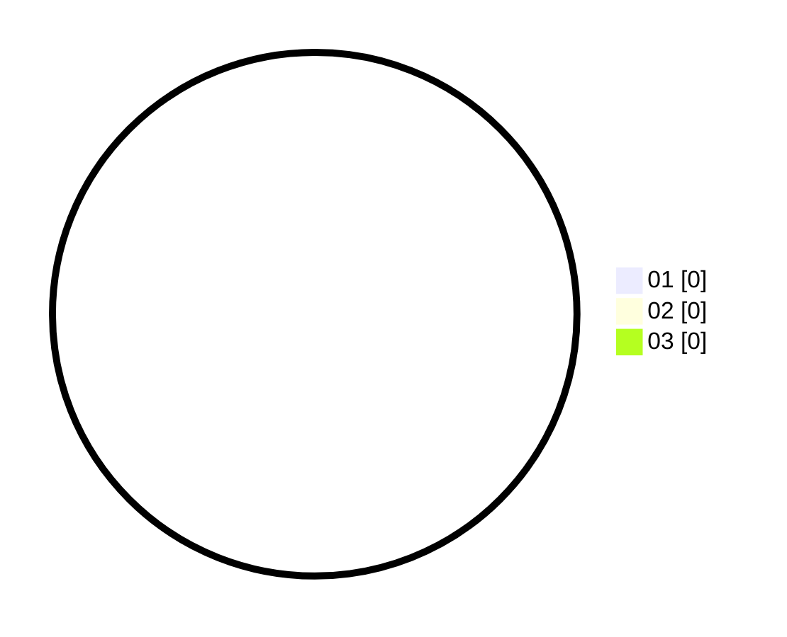

# Hasil

Hasil perolehan suara paslon dapat dilihat pada file paslon-01.txt, paslon-02.txt, dan paslon-03.txt.

Jika tidak ada, artinya data tersebut belum ada pada SIREKAP.

## Perolehan Suara

 * Paslon 01: **0**.
 * Paslon 02: **0**.
 * Paslon 03: **0**.

## Foto C Plano

https://sirekap-obj-formc.kpu.go.id/614c/pemilu/ppwp/31/74/07/10/03/3174071003043-20240218-203649--8fbf25cf-48da-48aa-b076-5e01b073be3d.jpg

https://sirekap-obj-formc.kpu.go.id/614c/pemilu/ppwp/31/74/07/10/03/3174071003043-20240218-231223--6b1c0ed6-51ff-4b63-b5a2-e6f389f7965a.jpg

https://sirekap-obj-formc.kpu.go.id/614c/pemilu/ppwp/31/74/07/10/03/3174071003043-20240218-204632--e22f1d2e-997b-43ea-a8f5-570b4afe0c19.jpg

## DATA PEMILIH TETAP

Jumlah pemilih dalam DPT: **294**.
 * L: **148**.
 * P: **146**.

## DATA PENGGUNA HAK PILIH

Jumlah pengguna hak pilih dalam DPT: **216**.
 * L: **103**.
 * P: **113**.

Jumlah pengguna hak pilih dalam DPTb: **1**.
 * L: **0**.
 * P: **1**.

Jumlah pengguna hak pilih dalam DPK: **2**.
 * L: **1**.
 * P: **1**.

Jumlah pengguna hak pilih: **219**.
 * L: **104**.
 * P: **115**.

## JUMLAH SUARA SAH DAN TIDAK SAH

JUMLAH SELURUH SUARA SAH: **215**.

JUMLAH SUARA TIDAK SAH: **5**.

JUMLAH SELURUH SUARA SAH DAN SUARA TIDAK SAH: **220**.
