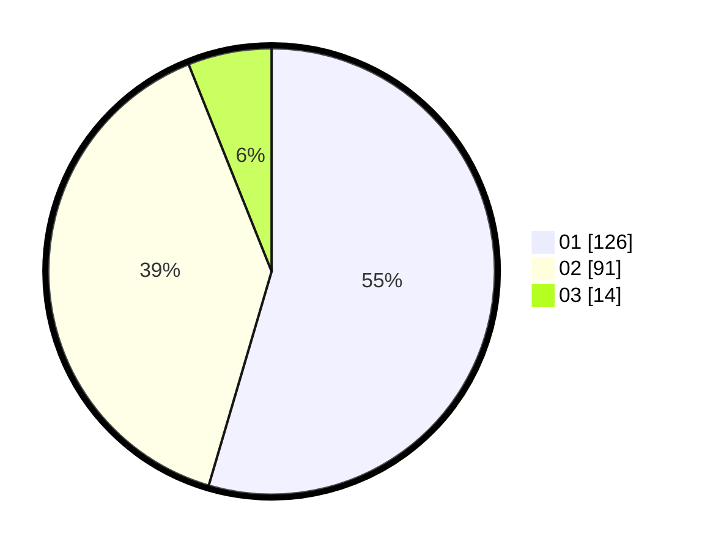

# Hasil

Hasil perolehan suara paslon dapat dilihat pada file paslon-01.txt, paslon-02.txt, dan paslon-03.txt.

Jika tidak ada, artinya data tersebut belum ada pada SIREKAP.

## Perolehan Suara

 * Paslon 01: **126**.
 * Paslon 02: **91**.
 * Paslon 03: **14**.

## Foto C Plano

https://sirekap-obj-formc.kpu.go.id/1c64/pemilu/ppwp/31/74/07/10/03/3174071003044-20240214-194528--3789da1e-aeba-414b-a20a-09eb59e4aff9.jpg

https://sirekap-obj-formc.kpu.go.id/1c64/pemilu/ppwp/31/74/07/10/03/3174071003044-20240214-192012--2a2d40ee-1997-449a-a808-5f75268fdbda.jpg

https://sirekap-obj-formc.kpu.go.id/1c64/pemilu/ppwp/31/74/07/10/03/3174071003044-20240214-192132--3d0ab95f-fbda-4640-a4e6-70e6a8a351b9.jpg

## DATA PEMILIH TETAP

Jumlah pemilih dalam DPT: **297**.
 * L: **151**.
 * P: **146**.

## DATA PENGGUNA HAK PILIH

Jumlah pengguna hak pilih dalam DPT: **223**.
 * L: **107**.
 * P: **116**.

Jumlah pengguna hak pilih dalam DPTb: **1**.
 * L: **0**.
 * P: **1**.

Jumlah pengguna hak pilih dalam DPK: **7**.
 * L: **2**.
 * P: **5**.

Jumlah pengguna hak pilih: **231**.
 * L: **108**.
 * P: **123**.

## JUMLAH SUARA SAH DAN TIDAK SAH

JUMLAH SELURUH SUARA SAH: **231**.

JUMLAH SUARA TIDAK SAH: **0**.

JUMLAH SELURUH SUARA SAH DAN SUARA TIDAK SAH: **231**.
