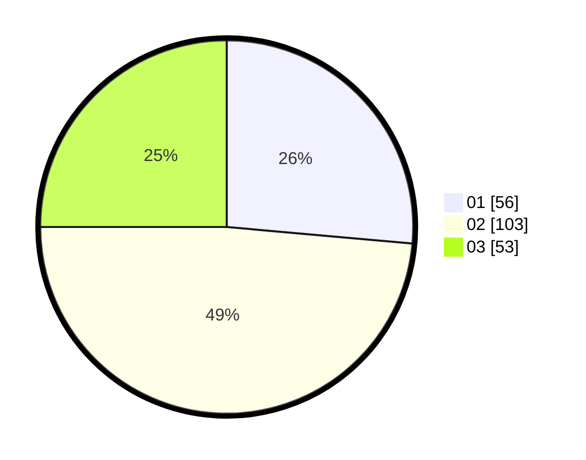

# Hasil

Hasil perolehan suara paslon dapat dilihat pada file paslon-01.txt, paslon-02.txt, dan paslon-03.txt.

Jika tidak ada, artinya data tersebut belum ada pada SIREKAP.

## Perolehan Suara

 * Paslon 01: **56**.
 * Paslon 02: **103**.
 * Paslon 03: **53**.

## Foto C Plano

https://sirekap-obj-formc.kpu.go.id/a9c9/pemilu/ppwp/31/74/07/10/03/3174071003047-20240218-215151--6637653d-e448-4da0-a564-caa4975ed847.jpg

https://sirekap-obj-formc.kpu.go.id/a9c9/pemilu/ppwp/31/74/07/10/03/3174071003047-20240218-215717--41303fc2-fb53-4637-af1a-e0c36a70b867.jpg

https://sirekap-obj-formc.kpu.go.id/a9c9/pemilu/ppwp/31/74/07/10/03/3174071003047-20240218-220015--0908e1da-d517-4d71-84dc-271b614a82a9.jpg

## DATA PEMILIH TETAP

Jumlah pemilih dalam DPT: **279**.
 * L: **138**.
 * P: **141**.

## DATA PENGGUNA HAK PILIH

Jumlah pengguna hak pilih dalam DPT: **204**.
 * L: **99**.
 * P: **105**.

Jumlah pengguna hak pilih dalam DPTb: **5**.
 * L: **1**.
 * P: **4**.

Jumlah pengguna hak pilih dalam DPK: **4**.
 * L: **3**.
 * P: **1**.

Jumlah pengguna hak pilih: **213**.
 * L: **103**.
 * P: **110**.

## JUMLAH SUARA SAH DAN TIDAK SAH

JUMLAH SELURUH SUARA SAH: **212**.

JUMLAH SUARA TIDAK SAH: **1**.

JUMLAH SELURUH SUARA SAH DAN SUARA TIDAK SAH: **213**.
