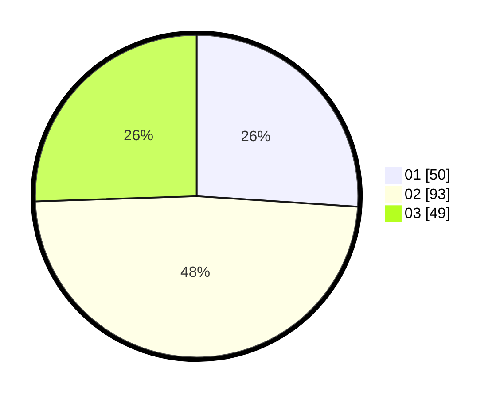

# Hasil

Hasil perolehan suara paslon dapat dilihat pada file paslon-01.txt, paslon-02.txt, dan paslon-03.txt.

Jika tidak ada, artinya data tersebut belum ada pada SIREKAP.

## Perolehan Suara

 * Paslon 01: **50**.
 * Paslon 02: **93**.
 * Paslon 03: **49**.

## Foto C Plano

https://sirekap-obj-formc.kpu.go.id/94ca/pemilu/ppwp/31/74/07/10/03/3174071003048-20240218-201838--5ed47c68-a249-4456-ac39-41f29f26e349.jpg

https://sirekap-obj-formc.kpu.go.id/94ca/pemilu/ppwp/31/74/07/10/03/3174071003048-20240218-202006--13f80be3-13c4-4ff1-ba60-52fced56f0bf.jpg

https://sirekap-obj-formc.kpu.go.id/94ca/pemilu/ppwp/31/74/07/10/03/3174071003048-20240218-202114--3d0e8d2f-801d-453f-abb0-68fdd3f377af.jpg

## DATA PEMILIH TETAP

Jumlah pemilih dalam DPT: **265**.
 * L: **147**.
 * P: **118**.

## DATA PENGGUNA HAK PILIH

Jumlah pengguna hak pilih dalam DPT: **187**.
 * L: **111**.
 * P: **76**.

Jumlah pengguna hak pilih dalam DPTb: **4**.
 * L: **1**.
 * P: **3**.

Jumlah pengguna hak pilih dalam DPK: **3**.
 * L: **0**.
 * P: **3**.

Jumlah pengguna hak pilih: **194**.
 * L: **112**.
 * P: **82**.

## JUMLAH SUARA SAH DAN TIDAK SAH

JUMLAH SELURUH SUARA SAH: **192**.

JUMLAH SUARA TIDAK SAH: **2**.

JUMLAH SELURUH SUARA SAH DAN SUARA TIDAK SAH: **194**.
