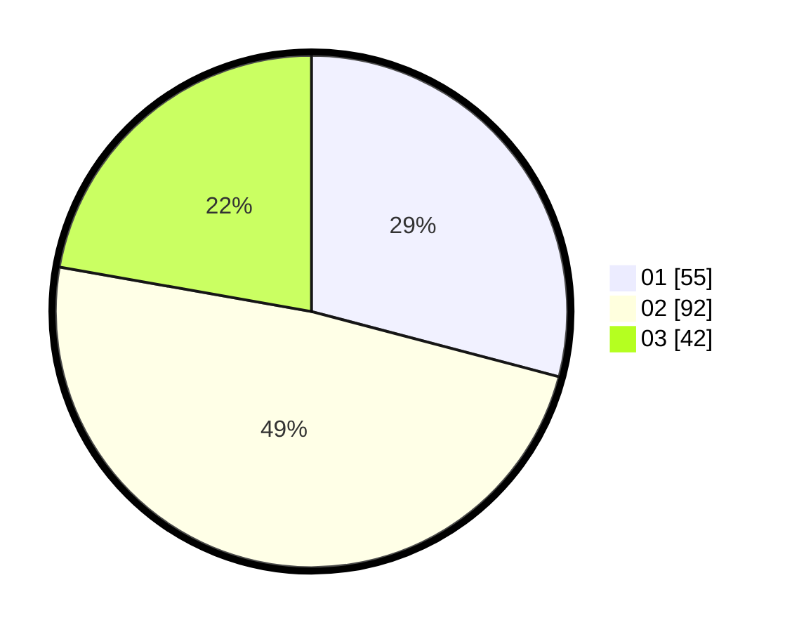

# Hasil

Hasil perolehan suara paslon dapat dilihat pada file paslon-01.txt, paslon-02.txt, dan paslon-03.txt.

Jika tidak ada, artinya data tersebut belum ada pada SIREKAP.

## Perolehan Suara

 * Paslon 01: **55**.
 * Paslon 02: **92**.
 * Paslon 03: **42**.

## Foto C Plano

https://sirekap-obj-formc.kpu.go.id/71dd/pemilu/ppwp/31/74/07/10/04/3174071004003-20240217-100035--3e1400a8-c81a-473d-a3c0-8c8fd4a9321e.jpg

https://sirekap-obj-formc.kpu.go.id/71dd/pemilu/ppwp/31/74/07/10/04/3174071004003-20240217-100101--cc05ffcb-35f3-46bf-ac70-1014617f837f.jpg

https://sirekap-obj-formc.kpu.go.id/71dd/pemilu/ppwp/31/74/07/10/04/3174071004003-20240217-100225--f1c1c65e-3cac-4796-af69-00c292789584.jpg

## DATA PEMILIH TETAP

Jumlah pemilih dalam DPT: **211**.
 * L: **96**.
 * P: **115**.

## DATA PENGGUNA HAK PILIH

Jumlah pengguna hak pilih dalam DPT: **171**.
 * L: **79**.
 * P: **92**.

Jumlah pengguna hak pilih dalam DPTb: **15**.
 * L: **9**.
 * P: **6**.

Jumlah pengguna hak pilih dalam DPK: **8**.
 * L: **6**.
 * P: **2**.

Jumlah pengguna hak pilih: **194**.
 * L: **94**.
 * P: **100**.

## JUMLAH SUARA SAH DAN TIDAK SAH

JUMLAH SELURUH SUARA SAH: **189**.

JUMLAH SUARA TIDAK SAH: **5**.

JUMLAH SELURUH SUARA SAH DAN SUARA TIDAK SAH: **194**.
