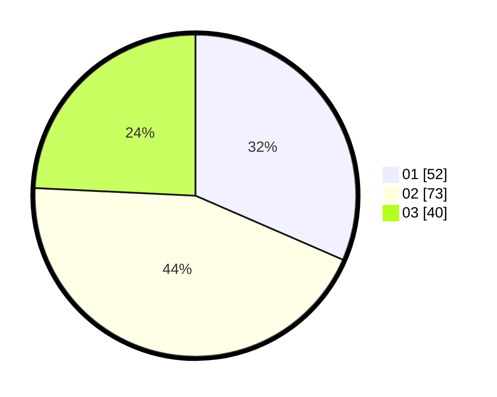

# Hasil

Hasil perolehan suara paslon dapat dilihat pada file paslon-01.txt, paslon-02.txt, dan paslon-03.txt.

Jika tidak ada, artinya data tersebut belum ada pada SIREKAP.

## Perolehan Suara

 * Paslon 01: **52**.
 * Paslon 02: **73**.
 * Paslon 03: **40**.

## Foto C Plano

https://sirekap-obj-formc.kpu.go.id/c69a/pemilu/ppwp/31/74/07/10/04/3174071004008-20240218-181216--b1c150f0-649d-471c-972d-b8d79f9b1705.jpg

https://sirekap-obj-formc.kpu.go.id/c69a/pemilu/ppwp/31/74/07/10/04/3174071004008-20240218-181244--bb3a46ac-2d1b-4656-b4f7-20295a260813.jpg

https://sirekap-obj-formc.kpu.go.id/c69a/pemilu/ppwp/31/74/07/10/04/3174071004008-20240218-181325--2dbc0535-1bf8-4fc8-b2e3-0e7cb8e46338.jpg

## DATA PEMILIH TETAP

Jumlah pemilih dalam DPT: **199**.
 * L: **91**.
 * P: **108**.

## DATA PENGGUNA HAK PILIH

Jumlah pengguna hak pilih dalam DPT: **153**.
 * L: **67**.
 * P: **86**.

Jumlah pengguna hak pilih dalam DPTb: **16**.
 * L: **6**.
 * P: **10**.

Jumlah pengguna hak pilih dalam DPK: **1**.
 * L: **1**.
 * P: **0**.

Jumlah pengguna hak pilih: **170**.
 * L: **74**.
 * P: **96**.

## JUMLAH SUARA SAH DAN TIDAK SAH

JUMLAH SELURUH SUARA SAH: **165**.

JUMLAH SUARA TIDAK SAH: **5**.

JUMLAH SELURUH SUARA SAH DAN SUARA TIDAK SAH: **170**.
