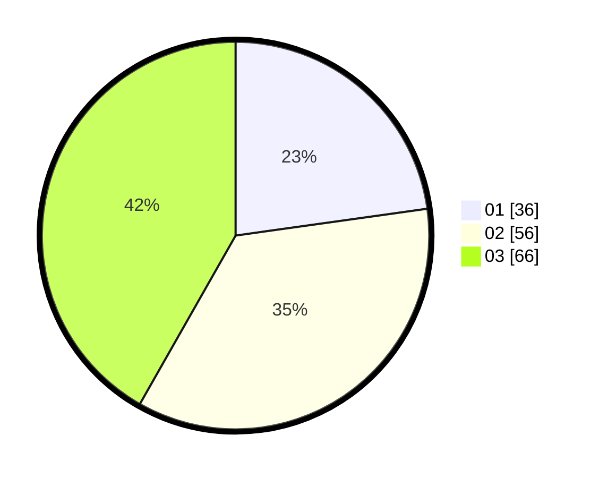

# Hasil

Hasil perolehan suara paslon dapat dilihat pada file paslon-01.txt, paslon-02.txt, dan paslon-03.txt.

Jika tidak ada, artinya data tersebut belum ada pada SIREKAP.

## Perolehan Suara

 * Paslon 01: **36**.
 * Paslon 02: **56**.
 * Paslon 03: **66**.

## Foto C Plano

https://sirekap-obj-formc.kpu.go.id/7d13/pemilu/ppwp/31/74/07/10/04/3174071004011-20240218-144937--77c4c8ed-85a3-4f6b-b226-68cd39cc06ad.jpg

https://sirekap-obj-formc.kpu.go.id/7d13/pemilu/ppwp/31/74/07/10/04/3174071004011-20240218-145135--b0bca362-1155-46b5-8156-66332787ccfb.jpg

https://sirekap-obj-formc.kpu.go.id/7d13/pemilu/ppwp/31/74/07/10/04/3174071004011-20240218-145750--e1277386-d2db-4f83-9b5c-517cf5572f76.jpg

## DATA PEMILIH TETAP

Jumlah pemilih dalam DPT: **189**.
 * L: **87**.
 * P: **102**.

## DATA PENGGUNA HAK PILIH

Jumlah pengguna hak pilih dalam DPT: **140**.
 * L: **59**.
 * P: **81**.

Jumlah pengguna hak pilih dalam DPTb: **19**.
 * L: **4**.
 * P: **15**.

Jumlah pengguna hak pilih dalam DPK: **0**.
 * L: **0**.
 * P: **0**.

Jumlah pengguna hak pilih: **159**.
 * L: **63**.
 * P: **96**.

## JUMLAH SUARA SAH DAN TIDAK SAH

JUMLAH SELURUH SUARA SAH: **158**.

JUMLAH SUARA TIDAK SAH: **1**.

JUMLAH SELURUH SUARA SAH DAN SUARA TIDAK SAH: **159**.
