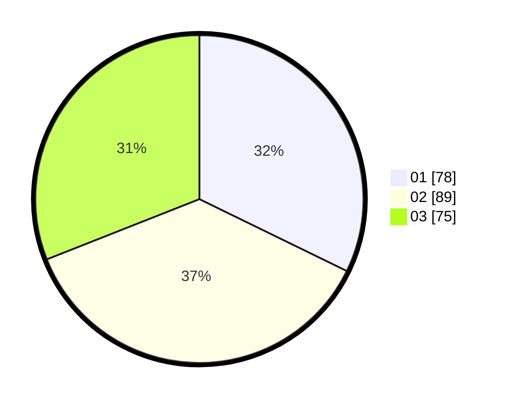

# Hasil

Hasil perolehan suara paslon dapat dilihat pada file paslon-01.txt, paslon-02.txt, dan paslon-03.txt.

Jika tidak ada, artinya data tersebut belum ada pada SIREKAP.

## Perolehan Suara

 * Paslon 01: **78**.
 * Paslon 02: **89**.
 * Paslon 03: **75**.

## Foto C Plano

https://sirekap-obj-formc.kpu.go.id/5333/pemilu/ppwp/31/74/07/10/05/3174071005001-20240218-120114--aa405367-5654-4a4f-a02c-def8343a4b3d.jpg

https://sirekap-obj-formc.kpu.go.id/5333/pemilu/ppwp/31/74/07/10/05/3174071005001-20240218-121147--67c1eea3-5231-4bc6-9163-78ee983a579a.jpg

https://sirekap-obj-formc.kpu.go.id/5333/pemilu/ppwp/31/74/07/10/05/3174071005001-20240218-121719--e8dbe384-4fa7-4c6d-bff8-80a987ee040f.jpg

## DATA PEMILIH TETAP

Jumlah pemilih dalam DPT: **277**.
 * L: **124**.
 * P: **153**.

## DATA PENGGUNA HAK PILIH

Jumlah pengguna hak pilih dalam DPT: **226**.
 * L: **97**.
 * P: **129**.

Jumlah pengguna hak pilih dalam DPTb: **19**.
 * L: **14**.
 * P: **5**.

Jumlah pengguna hak pilih dalam DPK: **2**.
 * L: **1**.
 * P: **1**.

Jumlah pengguna hak pilih: **247**.
 * L: **112**.
 * P: **135**.

## JUMLAH SUARA SAH DAN TIDAK SAH

JUMLAH SELURUH SUARA SAH: **242**.

JUMLAH SUARA TIDAK SAH: **5**.

JUMLAH SELURUH SUARA SAH DAN SUARA TIDAK SAH: **247**.
