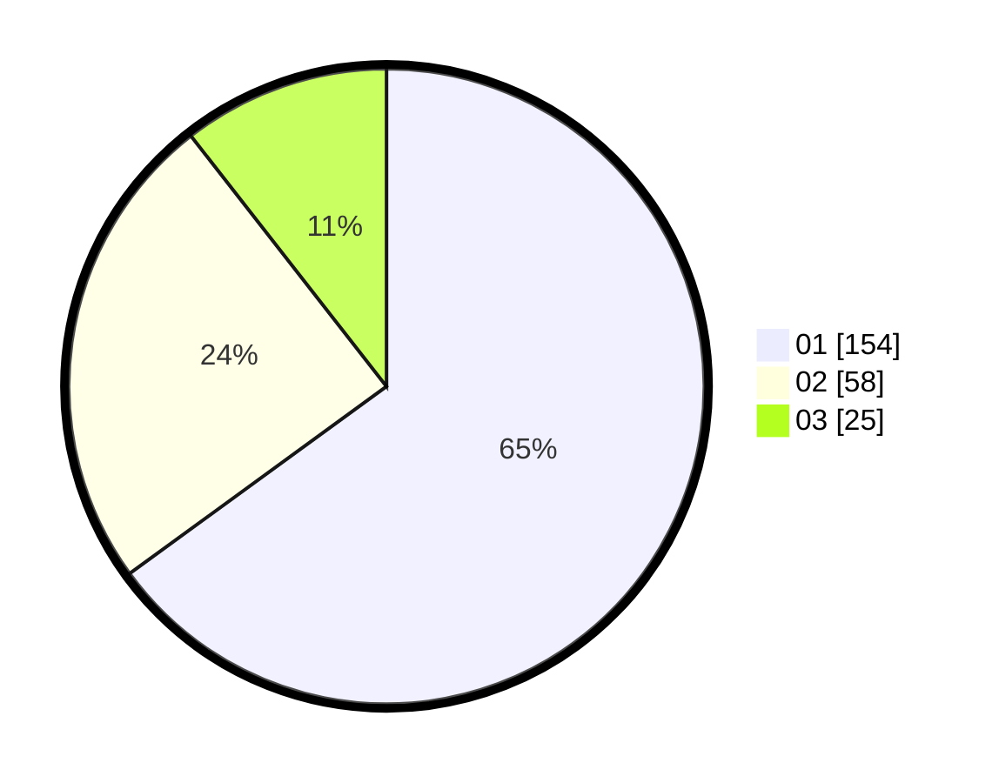

# Hasil

Hasil perolehan suara paslon dapat dilihat pada file paslon-01.txt, paslon-02.txt, dan paslon-03.txt.

Jika tidak ada, artinya data tersebut belum ada pada SIREKAP.

## Perolehan Suara

 * Paslon 01: **154**.
 * Paslon 02: **58**.
 * Paslon 03: **25**.

## Foto C Plano

https://sirekap-obj-formc.kpu.go.id/02b2/pemilu/ppwp/31/74/07/10/05/3174071005004-20240219-143802--7c901b66-8897-4c25-88d5-010aea2d75a2.jpg

https://sirekap-obj-formc.kpu.go.id/02b2/pemilu/ppwp/31/74/07/10/05/3174071005004-20240219-152706--5f6b6449-c68f-455f-a2b1-9980799f5fa3.jpg

https://sirekap-obj-formc.kpu.go.id/02b2/pemilu/ppwp/31/74/07/10/05/3174071005004-20240219-143928--929aa421-f628-4eee-bd3b-35d3f1f97e60.jpg

## DATA PEMILIH TETAP

Jumlah pemilih dalam DPT: **277**.
 * L: **133**.
 * P: **144**.

## DATA PENGGUNA HAK PILIH

Jumlah pengguna hak pilih dalam DPT: **221**.
 * L: **102**.
 * P: **119**.

Jumlah pengguna hak pilih dalam DPTb: **21**.
 * L: **4**.
 * P: **17**.

Jumlah pengguna hak pilih dalam DPK: **0**.
 * L: **0**.
 * P: **0**.

Jumlah pengguna hak pilih: **242**.
 * L: **106**.
 * P: **136**.

## JUMLAH SUARA SAH DAN TIDAK SAH

JUMLAH SELURUH SUARA SAH: **237**.

JUMLAH SUARA TIDAK SAH: **5**.

JUMLAH SELURUH SUARA SAH DAN SUARA TIDAK SAH: **242**.
