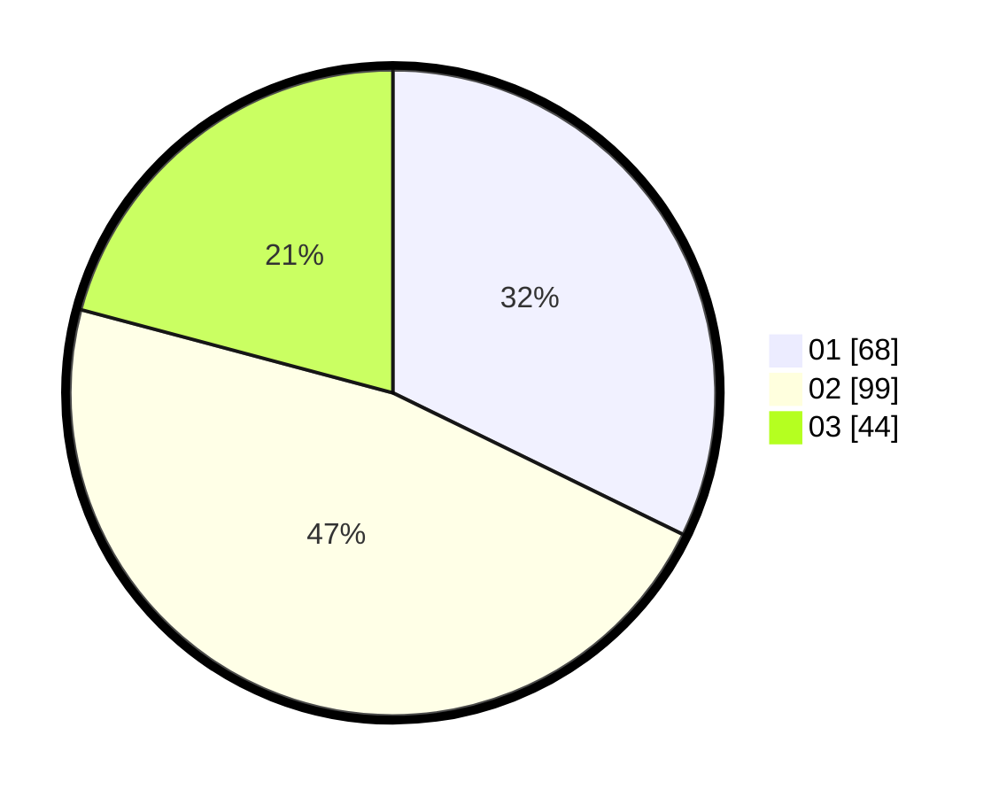

# Hasil

Hasil perolehan suara paslon dapat dilihat pada file paslon-01.txt, paslon-02.txt, dan paslon-03.txt.

Jika tidak ada, artinya data tersebut belum ada pada SIREKAP.

## Perolehan Suara

 * Paslon 01: **68**.
 * Paslon 02: **99**.
 * Paslon 03: **44**.

## Foto C Plano

https://sirekap-obj-formc.kpu.go.id/5d24/pemilu/ppwp/31/74/07/10/09/3174071009001-20240214-192908--884c5d85-99df-4ae5-874f-a5e30c9fcf59.jpg

https://sirekap-obj-formc.kpu.go.id/5d24/pemilu/ppwp/31/74/07/10/09/3174071009001-20240214-185529--dbc0ee22-9c4c-43b2-af03-bfe23b0842ff.jpg

https://sirekap-obj-formc.kpu.go.id/5d24/pemilu/ppwp/31/74/07/10/09/3174071009001-20240214-185744--1c031aa0-49bb-400c-984a-eb559914b6f3.jpg

## DATA PEMILIH TETAP

Jumlah pemilih dalam DPT: **269**.
 * L: **136**.
 * P: **133**.

## DATA PENGGUNA HAK PILIH

Jumlah pengguna hak pilih dalam DPT: **197**.
 * L: **98**.
 * P: **99**.

Jumlah pengguna hak pilih dalam DPTb: **13**.
 * L: **7**.
 * P: **6**.

Jumlah pengguna hak pilih dalam DPK: **2**.
 * L: **1**.
 * P: **1**.

Jumlah pengguna hak pilih: **212**.
 * L: **106**.
 * P: **106**.

## JUMLAH SUARA SAH DAN TIDAK SAH

JUMLAH SELURUH SUARA SAH: **211**.

JUMLAH SUARA TIDAK SAH: **1**.

JUMLAH SELURUH SUARA SAH DAN SUARA TIDAK SAH: **212**.
