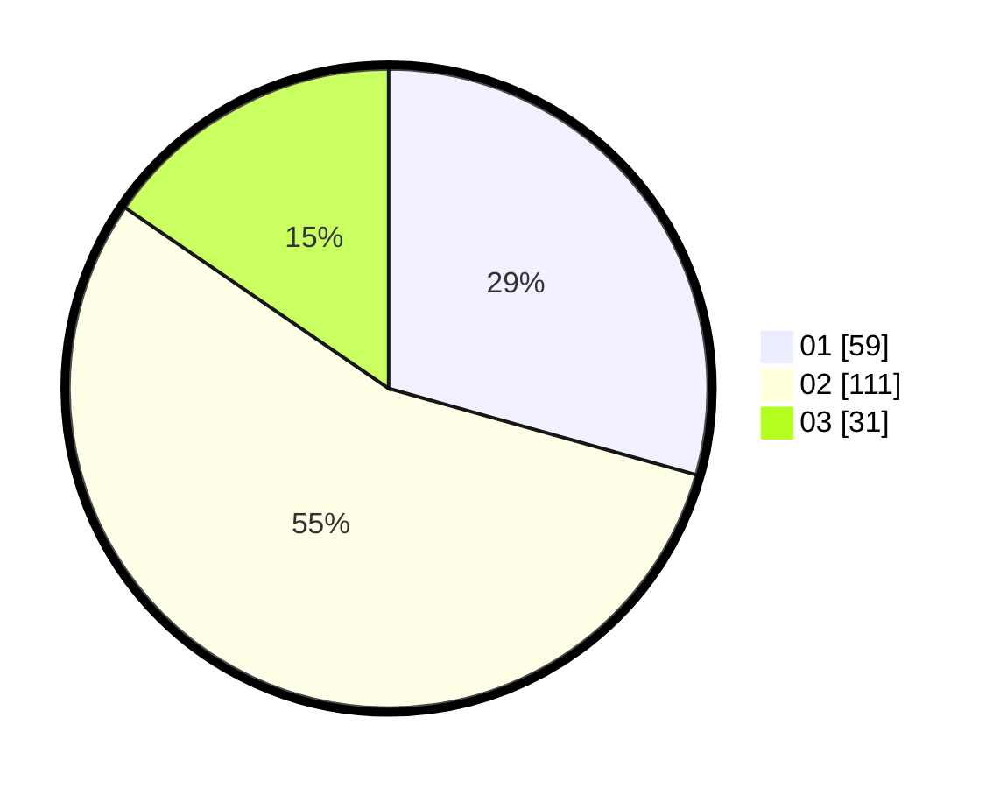

# Hasil

Hasil perolehan suara paslon dapat dilihat pada file paslon-01.txt, paslon-02.txt, dan paslon-03.txt.

Jika tidak ada, artinya data tersebut belum ada pada SIREKAP.

## Perolehan Suara

 * Paslon 01: **59**.
 * Paslon 02: **111**.
 * Paslon 03: **31**.

## Foto C Plano

https://sirekap-obj-formc.kpu.go.id/cd65/pemilu/ppwp/31/74/07/10/09/3174071009002-20240216-171403--28b2872a-1f37-4112-a4fa-a716bc41807c.jpg

https://sirekap-obj-formc.kpu.go.id/cd65/pemilu/ppwp/31/74/07/10/09/3174071009002-20240216-171437--add7d9b4-5016-4dba-bae1-14e8469a90f9.jpg

https://sirekap-obj-formc.kpu.go.id/cd65/pemilu/ppwp/31/74/07/10/09/3174071009002-20240216-171510--cc7cea48-5a50-4038-8fce-204e2869065f.jpg

## DATA PEMILIH TETAP

Jumlah pemilih dalam DPT: **265**.
 * L: **33**.
 * P: **22**.

## DATA PENGGUNA HAK PILIH

Jumlah pengguna hak pilih dalam DPT: **295**.
 * L: **899**.
 * P: **897**.

Jumlah pengguna hak pilih dalam DPTb: **844**.
 * L: **886**.
 * P: **884**.

Jumlah pengguna hak pilih dalam DPK: **885**.
 * L: **888**.
 * P: **883**.

Jumlah pengguna hak pilih: **523**.
 * L: **284**.
 * P: **844**.

## JUMLAH SUARA SAH DAN TIDAK SAH

JUMLAH SELURUH SUARA SAH: **201**.

JUMLAH SUARA TIDAK SAH: **2**.

JUMLAH SELURUH SUARA SAH DAN SUARA TIDAK SAH: **203**.
