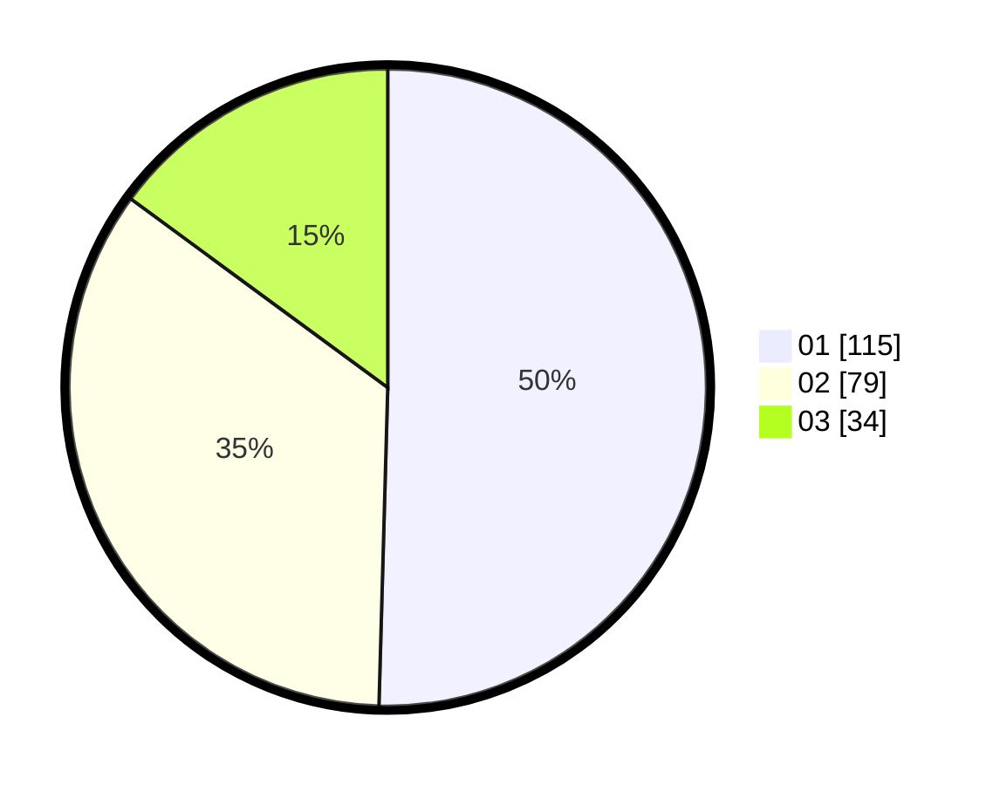

# Hasil

Hasil perolehan suara paslon dapat dilihat pada file paslon-01.txt, paslon-02.txt, dan paslon-03.txt.

Jika tidak ada, artinya data tersebut belum ada pada SIREKAP.

## Perolehan Suara

 * Paslon 01: **115**.
 * Paslon 02: **79**.
 * Paslon 03: **34**.

## Foto C Plano

https://sirekap-obj-formc.kpu.go.id/014f/pemilu/ppwp/31/74/07/10/09/3174071009003-20240216-183204--887615ae-d2ac-4496-ac4c-69903f14d5e0.jpg

https://sirekap-obj-formc.kpu.go.id/014f/pemilu/ppwp/31/74/07/10/09/3174071009003-20240216-183255--7fcea2d0-4dd3-4955-b07b-0d70eec62f0f.jpg

https://sirekap-obj-formc.kpu.go.id/014f/pemilu/ppwp/31/74/07/10/09/3174071009003-20240216-183403--64273251-8b7b-42e3-8bf2-e14fabc7c74c.jpg

## DATA PEMILIH TETAP

Jumlah pemilih dalam DPT: **382**.
 * L: **38**.
 * P: **438**.

## DATA PENGGUNA HAK PILIH

Jumlah pengguna hak pilih dalam DPT: **355**.
 * L: **553**.
 * P: **553**.

Jumlah pengguna hak pilih dalam DPTb: **804**.
 * L: **883**.
 * P: **886**.

Jumlah pengguna hak pilih dalam DPK: **880**.
 * L: **885**.
 * P: **888**.

Jumlah pengguna hak pilih: **330**.
 * L: **306**.
 * P: **325**.

## JUMLAH SUARA SAH DAN TIDAK SAH

JUMLAH SELURUH SUARA SAH: **228**.

JUMLAH SUARA TIDAK SAH: **3**.

JUMLAH SELURUH SUARA SAH DAN SUARA TIDAK SAH: **231**.
