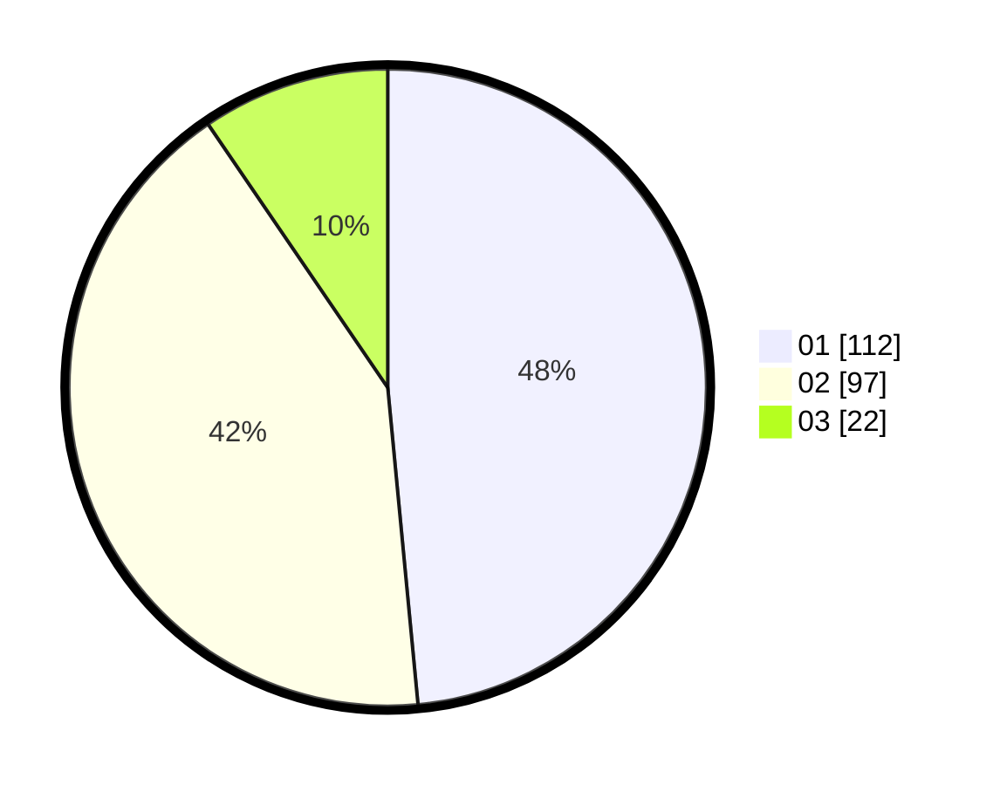

# Hasil

Hasil perolehan suara paslon dapat dilihat pada file paslon-01.txt, paslon-02.txt, dan paslon-03.txt.

Jika tidak ada, artinya data tersebut belum ada pada SIREKAP.

## Perolehan Suara

 * Paslon 01: **112**.
 * Paslon 02: **97**.
 * Paslon 03: **22**.

## Foto C Plano

https://sirekap-obj-formc.kpu.go.id/14da/pemilu/ppwp/31/74/07/10/09/3174071009006-20240217-103441--5dddf4d5-ed20-45b7-95e9-803346eb187e.jpg

https://sirekap-obj-formc.kpu.go.id/14da/pemilu/ppwp/31/74/07/10/09/3174071009006-20240217-103633--c6518b8d-78f2-47ca-b156-a327e93d6be2.jpg

https://sirekap-obj-formc.kpu.go.id/14da/pemilu/ppwp/31/74/07/10/09/3174071009006-20240217-103717--2578175f-28d9-4083-8f1a-238086d98369.jpg

## DATA PEMILIH TETAP

Jumlah pemilih dalam DPT: **269**.
 * L: **131**.
 * P: **138**.

## DATA PENGGUNA HAK PILIH

Jumlah pengguna hak pilih dalam DPT: **220**.
 * L: **103**.
 * P: **117**.

Jumlah pengguna hak pilih dalam DPTb: **12**.
 * L: **5**.
 * P: **7**.

Jumlah pengguna hak pilih dalam DPK: **1**.
 * L: **0**.
 * P: **1**.

Jumlah pengguna hak pilih: **233**.
 * L: **108**.
 * P: **125**.

## JUMLAH SUARA SAH DAN TIDAK SAH

JUMLAH SELURUH SUARA SAH: **231**.

JUMLAH SUARA TIDAK SAH: **2**.

JUMLAH SELURUH SUARA SAH DAN SUARA TIDAK SAH: **233**.
