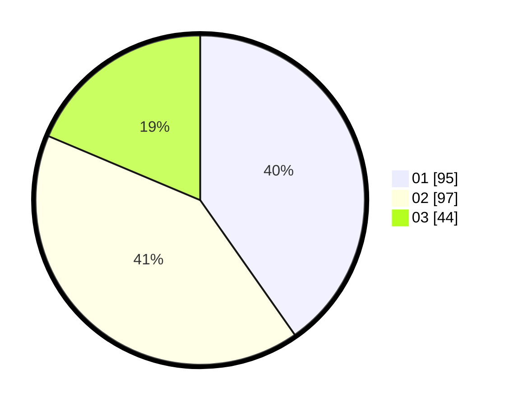

# Hasil

Hasil perolehan suara paslon dapat dilihat pada file paslon-01.txt, paslon-02.txt, dan paslon-03.txt.

Jika tidak ada, artinya data tersebut belum ada pada SIREKAP.

## Perolehan Suara

 * Paslon 01: **95**.
 * Paslon 02: **97**.
 * Paslon 03: **44**.

## Foto C Plano

https://sirekap-obj-formc.kpu.go.id/ff35/pemilu/ppwp/31/74/07/10/09/3174071009010-20240217-125503--2171d8db-fde4-4291-b1b6-8b1cf204005e.jpg

https://sirekap-obj-formc.kpu.go.id/ff35/pemilu/ppwp/31/74/07/10/09/3174071009010-20240217-125514--0539c9d4-e2d8-40ff-8b57-3ad71922aeaa.jpg

https://sirekap-obj-formc.kpu.go.id/ff35/pemilu/ppwp/31/74/07/10/09/3174071009010-20240217-125526--248575cb-249f-4e4f-93ed-64c6e25f1589.jpg

## DATA PEMILIH TETAP

Jumlah pemilih dalam DPT: **288**.
 * L: **534**.
 * P: **544**.

## DATA PENGGUNA HAK PILIH

Jumlah pengguna hak pilih dalam DPT: **552**.
 * L: **555**.
 * P: **555**.

Jumlah pengguna hak pilih dalam DPTb: **802**.
 * L: **882**.
 * P: **883**.

Jumlah pengguna hak pilih dalam DPK: **888**.
 * L: **888**.
 * P: **848**.

Jumlah pengguna hak pilih: **244**.
 * L: **332**.
 * P: **429**.

## JUMLAH SUARA SAH DAN TIDAK SAH

JUMLAH SELURUH SUARA SAH: **236**.

JUMLAH SUARA TIDAK SAH: **5**.

JUMLAH SELURUH SUARA SAH DAN SUARA TIDAK SAH: **241**.
