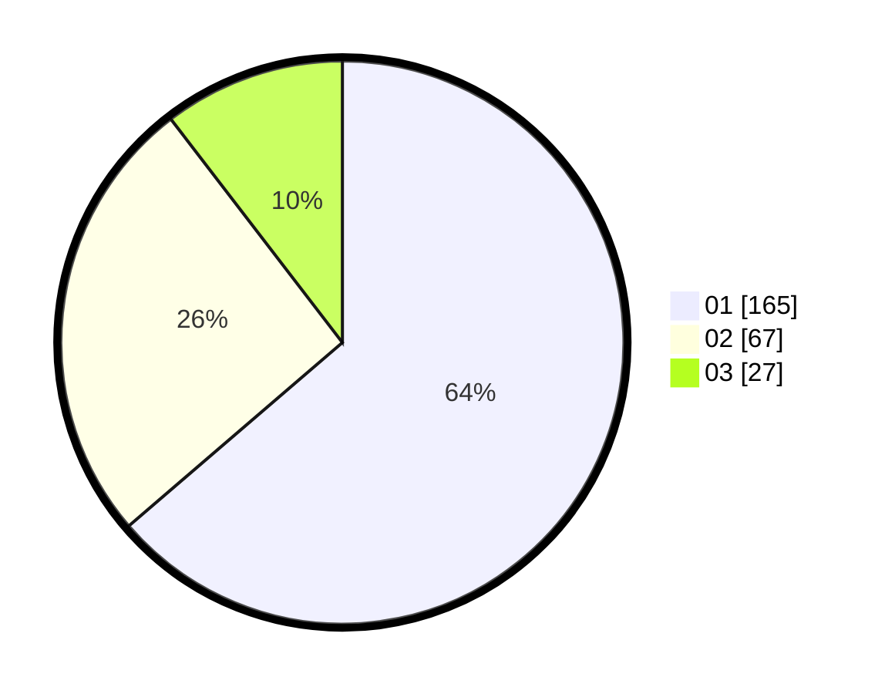

# Hasil

Hasil perolehan suara paslon dapat dilihat pada file paslon-01.txt, paslon-02.txt, dan paslon-03.txt.

Jika tidak ada, artinya data tersebut belum ada pada SIREKAP.

## Perolehan Suara

 * Paslon 01: **165**.
 * Paslon 02: **67**.
 * Paslon 03: **27**.

## Foto C Plano

https://sirekap-obj-formc.kpu.go.id/9d83/pemilu/ppwp/31/74/07/10/09/3174071009011-20240217-140945--d718e033-e901-41f5-91f2-fad91307afed.jpg

https://sirekap-obj-formc.kpu.go.id/9d83/pemilu/ppwp/31/74/07/10/09/3174071009011-20240217-141203--bc928b56-6dee-4d4e-b63e-ce1a3dd1b307.jpg

https://sirekap-obj-formc.kpu.go.id/9d83/pemilu/ppwp/31/74/07/10/09/3174071009011-20240217-141211--f154bac5-43a9-456a-b7dc-6c4fd12225e2.jpg

## DATA PEMILIH TETAP

Jumlah pemilih dalam DPT: **224**.
 * L: **22**.
 * P: **847**.

## DATA PENGGUNA HAK PILIH

Jumlah pengguna hak pilih dalam DPT: **252**.
 * L: **55**.
 * P: **538**.

Jumlah pengguna hak pilih dalam DPTb: **806**.
 * L: **888**.
 * P: **888**.

Jumlah pengguna hak pilih dalam DPK: **888**.
 * L: **888**.
 * P: **888**.

Jumlah pengguna hak pilih: **262**.
 * L: **888**.
 * P: **444**.

## JUMLAH SUARA SAH DAN TIDAK SAH

JUMLAH SELURUH SUARA SAH: **259**.

JUMLAH SUARA TIDAK SAH: **3**.

JUMLAH SELURUH SUARA SAH DAN SUARA TIDAK SAH: **262**.
