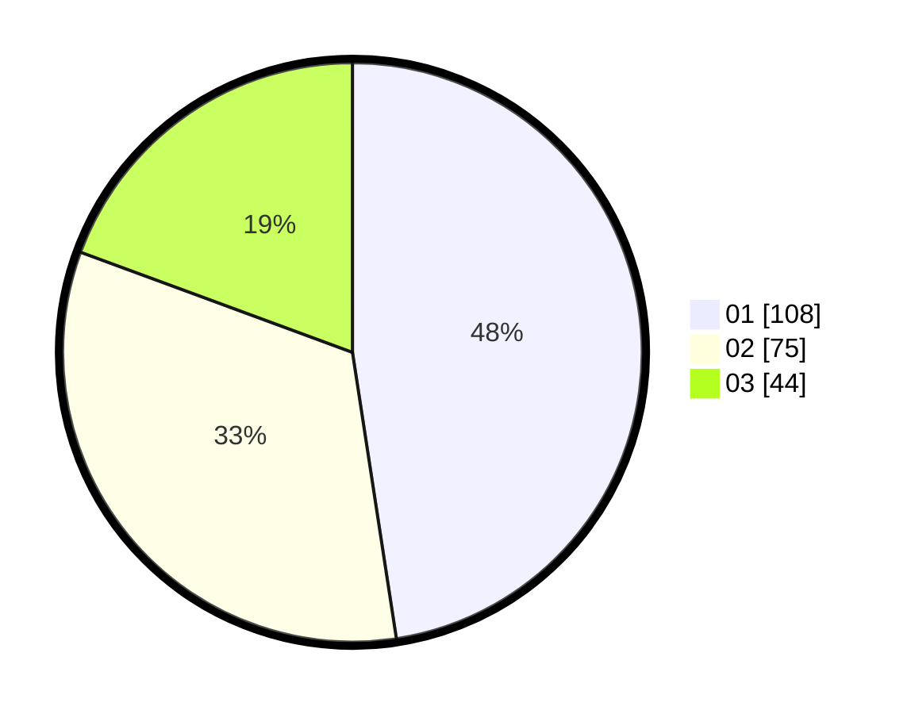

# Hasil

Hasil perolehan suara paslon dapat dilihat pada file paslon-01.txt, paslon-02.txt, dan paslon-03.txt.

Jika tidak ada, artinya data tersebut belum ada pada SIREKAP.

## Perolehan Suara

 * Paslon 01: **108**.
 * Paslon 02: **75**.
 * Paslon 03: **44**.

## Foto C Plano

https://sirekap-obj-formc.kpu.go.id/6a5f/pemilu/ppwp/31/74/07/10/09/3174071009012-20240217-144718--9b5936ef-a608-478c-8d52-90bf8a9d89f3.jpg

https://sirekap-obj-formc.kpu.go.id/6a5f/pemilu/ppwp/31/74/07/10/09/3174071009012-20240217-144848--d06a0285-f3f0-46b0-b708-1149d40b356c.jpg

https://sirekap-obj-formc.kpu.go.id/6a5f/pemilu/ppwp/31/74/07/10/09/3174071009012-20240217-145000--bdc63721-fbb0-4f8c-a930-4cf133ec7750.jpg

## DATA PEMILIH TETAP

Jumlah pemilih dalam DPT: **228**.
 * L: **422**.
 * P: **50**.

## DATA PENGGUNA HAK PILIH

Jumlah pengguna hak pilih dalam DPT: **526**.
 * L: **596**.
 * P: **725**.

Jumlah pengguna hak pilih dalam DPTb: **888**.
 * L: **826**.
 * P: **882**.

Jumlah pengguna hak pilih dalam DPK: **880**.
 * L: **880**.
 * P: **888**.

Jumlah pengguna hak pilih: **239**.
 * L: **403**.
 * P: **328**.

## JUMLAH SUARA SAH DAN TIDAK SAH

JUMLAH SELURUH SUARA SAH: **227**.

JUMLAH SUARA TIDAK SAH: **3**.

JUMLAH SELURUH SUARA SAH DAN SUARA TIDAK SAH: **230**.
