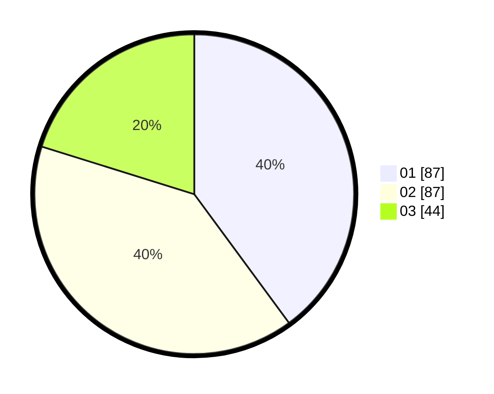

# Hasil

Hasil perolehan suara paslon dapat dilihat pada file paslon-01.txt, paslon-02.txt, dan paslon-03.txt.

Jika tidak ada, artinya data tersebut belum ada pada SIREKAP.

## Perolehan Suara

 * Paslon 01: **87**.
 * Paslon 02: **87**.
 * Paslon 03: **44**.

## Foto C Plano

https://sirekap-obj-formc.kpu.go.id/ca6e/pemilu/ppwp/31/74/07/10/09/3174071009013-20240217-152011--a28e3753-5905-46c4-8627-db818a1321f7.jpg

https://sirekap-obj-formc.kpu.go.id/ca6e/pemilu/ppwp/31/74/07/10/09/3174071009013-20240217-152031--003c9f36-32f3-4703-a382-33024368102e.jpg

https://sirekap-obj-formc.kpu.go.id/ca6e/pemilu/ppwp/31/74/07/10/09/3174071009013-20240217-152051--446d28cb-0dea-4be9-a6e5-cbd421caf8f0.jpg

## DATA PEMILIH TETAP

Jumlah pemilih dalam DPT: **255**.
 * L: **846**.
 * P: **420**.

## DATA PENGGUNA HAK PILIH

Jumlah pengguna hak pilih dalam DPT: **203**.
 * L: **200**.
 * P: **802**.

Jumlah pengguna hak pilih dalam DPTb: **2**.
 * L: **86**.
 * P: **80**.

Jumlah pengguna hak pilih dalam DPK: **88**.
 * L: **888**.
 * P: **888**.

Jumlah pengguna hak pilih: **220**.
 * L: **667**.
 * P: **803**.

## JUMLAH SUARA SAH DAN TIDAK SAH

JUMLAH SELURUH SUARA SAH: **218**.

JUMLAH SUARA TIDAK SAH: **2**.

JUMLAH SELURUH SUARA SAH DAN SUARA TIDAK SAH: **220**.
