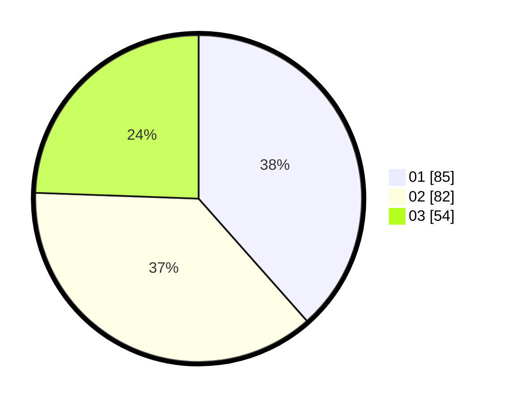

# Hasil

Hasil perolehan suara paslon dapat dilihat pada file paslon-01.txt, paslon-02.txt, dan paslon-03.txt.

Jika tidak ada, artinya data tersebut belum ada pada SIREKAP.

## Perolehan Suara

 * Paslon 01: **85**.
 * Paslon 02: **82**.
 * Paslon 03: **54**.

## Foto C Plano

https://sirekap-obj-formc.kpu.go.id/61e5/pemilu/ppwp/31/74/07/10/09/3174071009019-20240218-121640--9b10bffa-5114-4b9c-b09b-12422b04b099.jpg

https://sirekap-obj-formc.kpu.go.id/61e5/pemilu/ppwp/31/74/07/10/09/3174071009019-20240218-121651--7f57b4cd-d71d-46c0-8e94-b6343b6a68bc.jpg

https://sirekap-obj-formc.kpu.go.id/61e5/pemilu/ppwp/31/74/07/10/09/3174071009019-20240218-121704--4b68db13-fe9d-4a0a-8c54-ed52cc653ba4.jpg

## DATA PEMILIH TETAP

Jumlah pemilih dalam DPT: **239**.
 * L: **302**.
 * P: **430**.

## DATA PENGGUNA HAK PILIH

Jumlah pengguna hak pilih dalam DPT: **496**.
 * L: **889**.
 * P: **860**.

Jumlah pengguna hak pilih dalam DPTb: **827**.
 * L: **889**.
 * P: **842**.

Jumlah pengguna hak pilih dalam DPK: **884**.
 * L: **884**.
 * P: **888**.

Jumlah pengguna hak pilih: **242**.
 * L: **99**.
 * P: **443**.

## JUMLAH SUARA SAH DAN TIDAK SAH

JUMLAH SELURUH SUARA SAH: **203**.

JUMLAH SUARA TIDAK SAH: **50**.

JUMLAH SELURUH SUARA SAH DAN SUARA TIDAK SAH: **242**.
