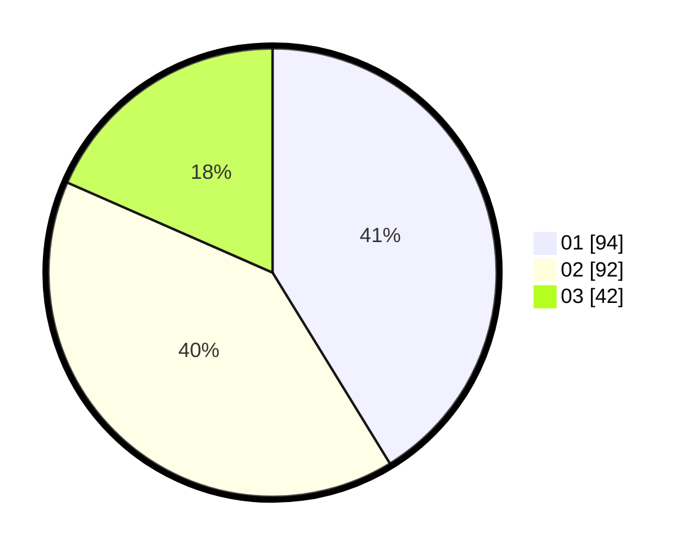

# Hasil

Hasil perolehan suara paslon dapat dilihat pada file paslon-01.txt, paslon-02.txt, dan paslon-03.txt.

Jika tidak ada, artinya data tersebut belum ada pada SIREKAP.

## Perolehan Suara

 * Paslon 01: **94**.
 * Paslon 02: **92**.
 * Paslon 03: **42**.

## Foto C Plano

https://sirekap-obj-formc.kpu.go.id/cec1/pemilu/ppwp/31/74/07/10/09/3174071009020-20240218-125752--d972d9e3-b6ec-421f-95e6-0f7a91ad9874.jpg

https://sirekap-obj-formc.kpu.go.id/cec1/pemilu/ppwp/31/74/07/10/09/3174071009020-20240218-125759--ead364ad-55fd-4152-8cee-267e576d04db.jpg

https://sirekap-obj-formc.kpu.go.id/cec1/pemilu/ppwp/31/74/07/10/09/3174071009020-20240218-130939--206ce6be-a325-4087-a237-b672ac44172b.jpg

## DATA PEMILIH TETAP

Jumlah pemilih dalam DPT: **263**.
 * L: **35**.
 * P: **528**.

## DATA PENGGUNA HAK PILIH

Jumlah pengguna hak pilih dalam DPT: **288**.
 * L: **98**.
 * P: **425**.

Jumlah pengguna hak pilih dalam DPTb: **23**.
 * L: **94**.
 * P: **49**.

Jumlah pengguna hak pilih dalam DPK: **98**.
 * L: **0**.
 * P: **0**.

Jumlah pengguna hak pilih: **230**.
 * L: **706**.
 * P: **625**.

## JUMLAH SUARA SAH DAN TIDAK SAH

JUMLAH SELURUH SUARA SAH: **228**.

JUMLAH SUARA TIDAK SAH: **3**.

JUMLAH SELURUH SUARA SAH DAN SUARA TIDAK SAH: **231**.
