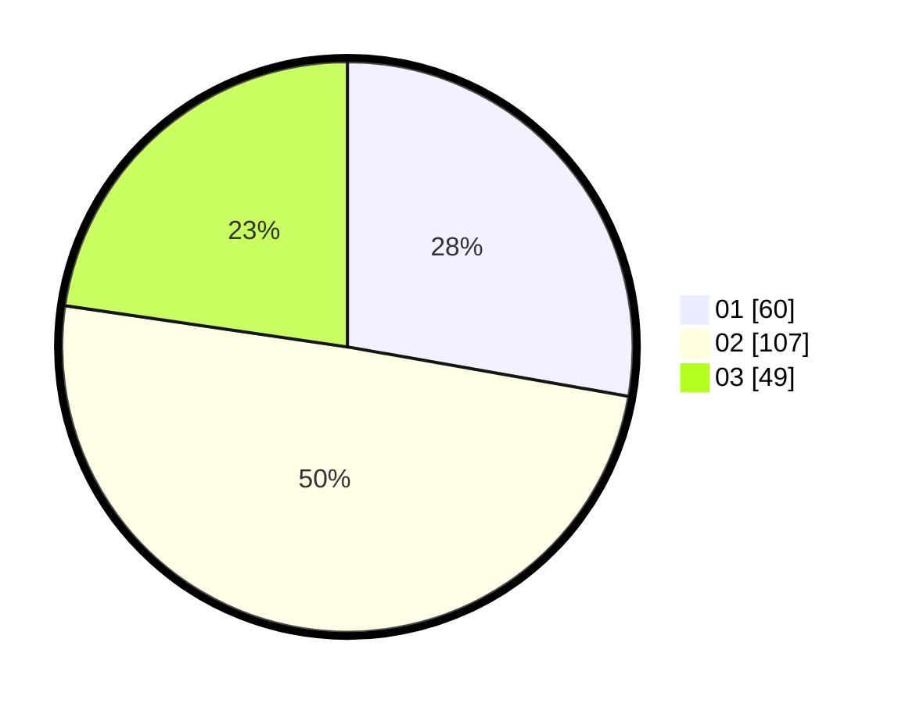

# Hasil

Hasil perolehan suara paslon dapat dilihat pada file paslon-01.txt, paslon-02.txt, dan paslon-03.txt.

Jika tidak ada, artinya data tersebut belum ada pada SIREKAP.

## Perolehan Suara

 * Paslon 01: **60**.
 * Paslon 02: **107**.
 * Paslon 03: **49**.

## Foto C Plano

https://sirekap-obj-formc.kpu.go.id/7219/pemilu/ppwp/31/74/07/10/09/3174071009021-20240218-135856--1f9b437d-71cc-47ec-b646-7feeaedeb79c.jpg

https://sirekap-obj-formc.kpu.go.id/7219/pemilu/ppwp/31/74/07/10/09/3174071009021-20240218-135940--4adcfe49-b9b1-45cd-b987-77542faae7d2.jpg

https://sirekap-obj-formc.kpu.go.id/7219/pemilu/ppwp/31/74/07/10/09/3174071009021-20240218-140027--4d0ecd3e-6742-4a57-9b4f-1182604bb2c5.jpg

## DATA PEMILIH TETAP

Jumlah pemilih dalam DPT: **266**.
 * L: **323**.
 * P: **243**.

## DATA PENGGUNA HAK PILIH

Jumlah pengguna hak pilih dalam DPT: **555**.
 * L: **895**.
 * P: **55**.

Jumlah pengguna hak pilih dalam DPTb: **842**.
 * L: **849**.
 * P: **882**.

Jumlah pengguna hak pilih dalam DPK: **888**.
 * L: **888**.
 * P: **888**.

Jumlah pengguna hak pilih: **248**.
 * L: **492**.
 * P: **43**.

## JUMLAH SUARA SAH DAN TIDAK SAH

JUMLAH SELURUH SUARA SAH: **206**.

JUMLAH SUARA TIDAK SAH: **882**.

JUMLAH SELURUH SUARA SAH DAN SUARA TIDAK SAH: **268**.
