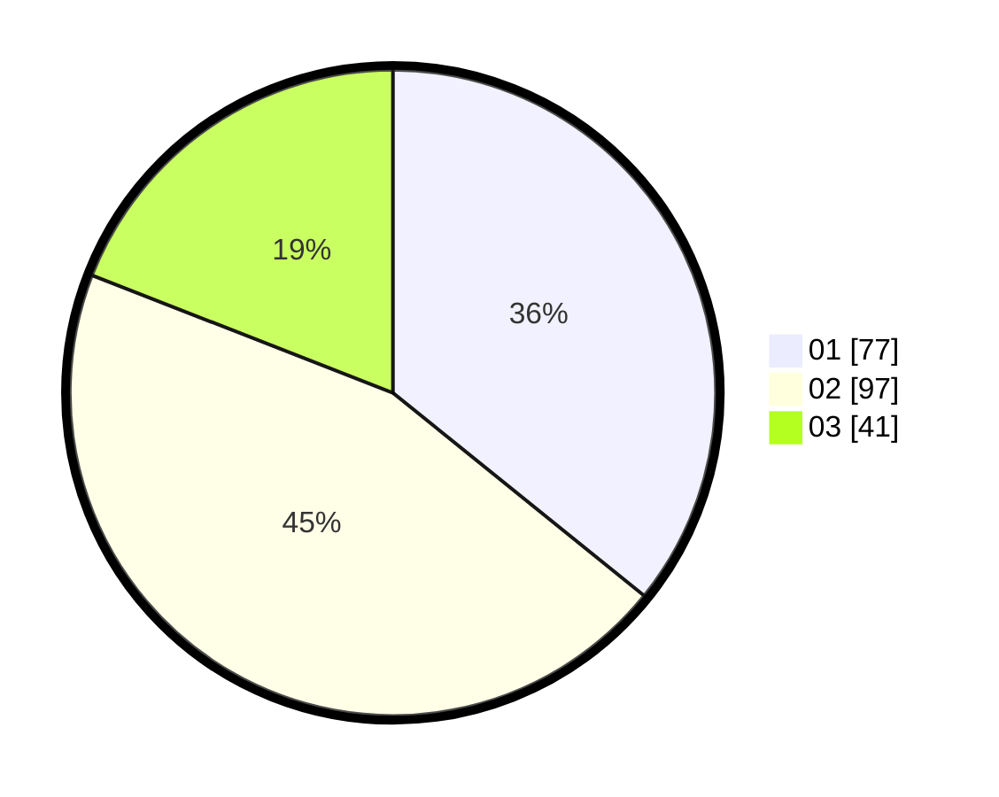

# Hasil

Hasil perolehan suara paslon dapat dilihat pada file paslon-01.txt, paslon-02.txt, dan paslon-03.txt.

Jika tidak ada, artinya data tersebut belum ada pada SIREKAP.

## Perolehan Suara

 * Paslon 01: **77**.
 * Paslon 02: **97**.
 * Paslon 03: **41**.

## Foto C Plano

https://sirekap-obj-formc.kpu.go.id/2c65/pemilu/ppwp/31/74/07/10/09/3174071009022-20240218-132642--fec1a6fa-66a6-4dab-ba6e-7653e9bae986.jpg

https://sirekap-obj-formc.kpu.go.id/2c65/pemilu/ppwp/31/74/07/10/09/3174071009022-20240218-132701--5f84ebf4-1eaa-4375-806a-ebefac5fbff0.jpg
