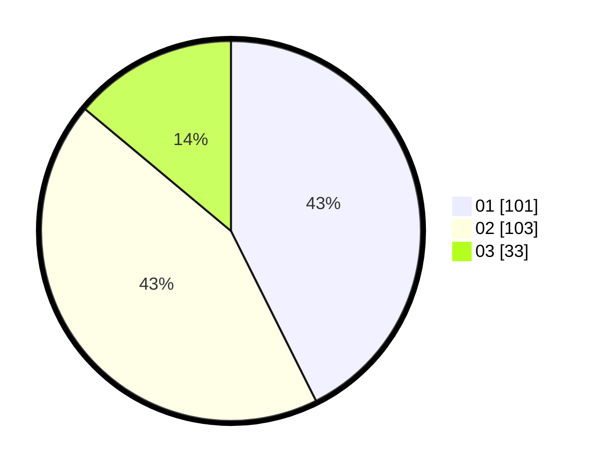

# Hasil

Hasil perolehan suara paslon dapat dilihat pada file paslon-01.txt, paslon-02.txt, dan paslon-03.txt.

Jika tidak ada, artinya data tersebut belum ada pada SIREKAP.

## Perolehan Suara

 * Paslon 01: **101**.
 * Paslon 02: **103**.
 * Paslon 03: **33**.

## Foto C Plano

https://sirekap-obj-formc.kpu.go.id/7bc5/pemilu/ppwp/31/74/07/10/09/3174071009023-20240218-145025--9ad43410-e9b7-4791-86cb-30197639e617.jpg

https://sirekap-obj-formc.kpu.go.id/7bc5/pemilu/ppwp/31/74/07/10/09/3174071009023-20240218-145058--e67f8493-adbe-4ffe-91f3-487af5486366.jpg

https://sirekap-obj-formc.kpu.go.id/7bc5/pemilu/ppwp/31/74/07/10/09/3174071009023-20240218-145143--3c745966-6c5a-4b2d-8885-89349333e64d.jpg

## DATA PEMILIH TETAP

Jumlah pemilih dalam DPT: **202**.
 * L: **435**.
 * P: **38**.

## DATA PENGGUNA HAK PILIH

Jumlah pengguna hak pilih dalam DPT: **233**.
 * L: **50**.
 * P: **23**.

Jumlah pengguna hak pilih dalam DPTb: **886**.
 * L: **886**.
 * P: **888**.

Jumlah pengguna hak pilih dalam DPK: **0**.
 * L: **880**.
 * P: **888**.

Jumlah pengguna hak pilih: **249**.
 * L: **0**.
 * P: **433**.

## JUMLAH SUARA SAH DAN TIDAK SAH

JUMLAH SELURUH SUARA SAH: **237**.

JUMLAH SUARA TIDAK SAH: **3**.

JUMLAH SELURUH SUARA SAH DAN SUARA TIDAK SAH: **240**.
