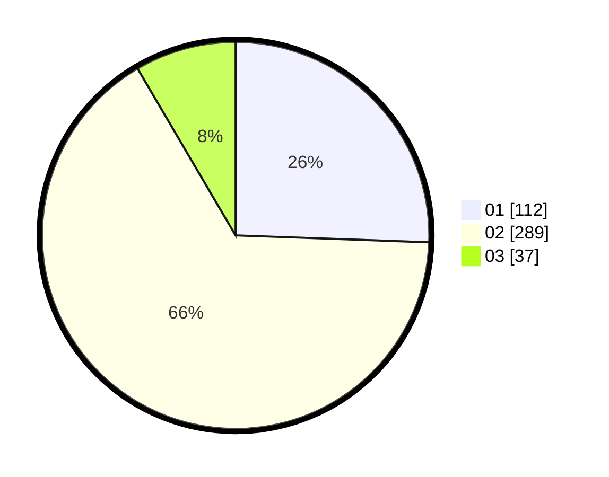

# Hasil

Hasil perolehan suara paslon dapat dilihat pada file paslon-01.txt, paslon-02.txt, dan paslon-03.txt.

Jika tidak ada, artinya data tersebut belum ada pada SIREKAP.

## Perolehan Suara

 * Paslon 01: **112**.
 * Paslon 02: **289**.
 * Paslon 03: **37**.

## Foto C Plano

https://sirekap-obj-formc.kpu.go.id/821d/pemilu/ppwp/31/74/07/10/09/3174071009024-20240215-012418--0ec2445b-f89c-43e7-a7e1-b6fe83768ff0.jpg

https://sirekap-obj-formc.kpu.go.id/821d/pemilu/ppwp/31/74/07/10/09/3174071009024-20240218-170613--e3fadee8-fadb-40e6-8b7b-9e46b95bdad1.jpg

https://sirekap-obj-formc.kpu.go.id/821d/pemilu/ppwp/31/74/07/10/09/3174071009024-20240218-170458--e8eaa7d6-4ce9-4a17-8f05-ab6c854e3921.jpg

## DATA PEMILIH TETAP

Jumlah pemilih dalam DPT: **269**.
 * L: **138**.
 * P: **131**.

## DATA PENGGUNA HAK PILIH

Jumlah pengguna hak pilih dalam DPT: **228**.
 * L: **112**.
 * P: **116**.

Jumlah pengguna hak pilih dalam DPTb: **9**.
 * L: **1**.
 * P: **8**.

Jumlah pengguna hak pilih dalam DPK: **2**.
 * L: **2**.
 * P: **0**.

Jumlah pengguna hak pilih: **239**.
 * L: **115**.
 * P: **124**.

## JUMLAH SUARA SAH DAN TIDAK SAH

JUMLAH SELURUH SUARA SAH: **338**.

JUMLAH SUARA TIDAK SAH: **84**.

JUMLAH SELURUH SUARA SAH DAN SUARA TIDAK SAH: **339**.
