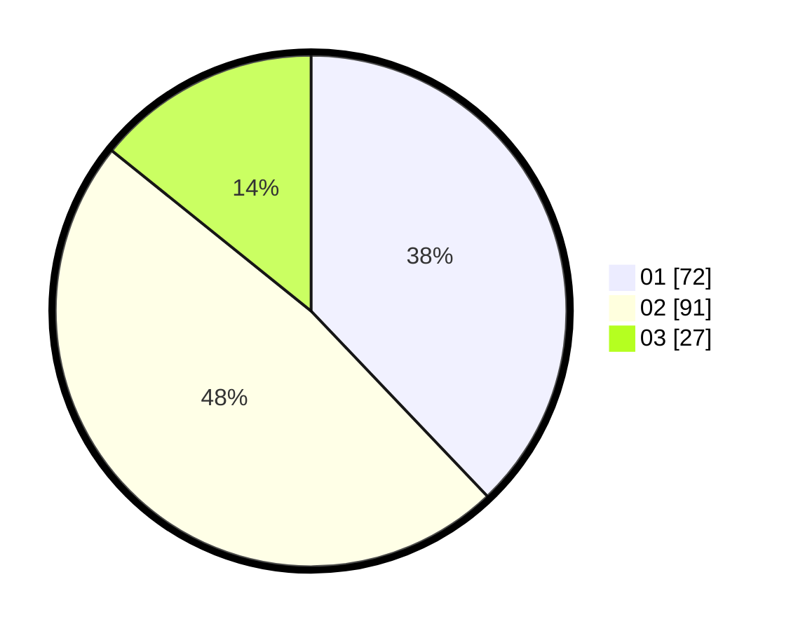

# Hasil

Hasil perolehan suara paslon dapat dilihat pada file paslon-01.txt, paslon-02.txt, dan paslon-03.txt.

Jika tidak ada, artinya data tersebut belum ada pada SIREKAP.

## Perolehan Suara

 * Paslon 01: **72**.
 * Paslon 02: **91**.
 * Paslon 03: **27**.

## Foto C Plano

https://sirekap-obj-formc.kpu.go.id/43da/pemilu/ppwp/31/74/07/10/09/3174071009025-20240218-170946--106b2426-c1cf-4e55-b78b-ec7081b8cbc1.jpg

https://sirekap-obj-formc.kpu.go.id/43da/pemilu/ppwp/31/74/07/10/09/3174071009025-20240218-171031--ce5c724f-d796-4e35-b687-1ba08412b71d.jpg

https://sirekap-obj-formc.kpu.go.id/43da/pemilu/ppwp/31/74/07/10/09/3174071009025-20240218-171132--01e57d9e-cfbf-4fe0-8356-711d85d9bd24.jpg

## DATA PEMILIH TETAP

Jumlah pemilih dalam DPT: **227**.
 * L: **112**.
 * P: **112**.

## DATA PENGGUNA HAK PILIH

Jumlah pengguna hak pilih dalam DPT: **170**.
 * L: **25**.
 * P: **33**.

Jumlah pengguna hak pilih dalam DPTb: **10**.
 * L: **6**.
 * P: **4**.

Jumlah pengguna hak pilih dalam DPK: **0**.
 * L: **0**.
 * P: **0**.

Jumlah pengguna hak pilih: **182**.
 * L: **91**.
 * P: **97**.

## JUMLAH SUARA SAH DAN TIDAK SAH

JUMLAH SELURUH SUARA SAH: **126**.

JUMLAH SUARA TIDAK SAH: **802**.

JUMLAH SELURUH SUARA SAH DAN SUARA TIDAK SAH: **188**.
