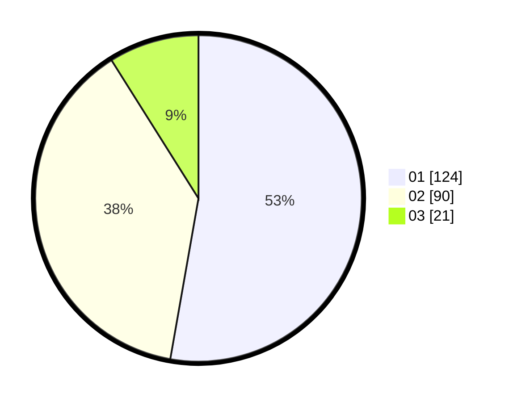

# Hasil

Hasil perolehan suara paslon dapat dilihat pada file paslon-01.txt, paslon-02.txt, dan paslon-03.txt.

Jika tidak ada, artinya data tersebut belum ada pada SIREKAP.

## Perolehan Suara

 * Paslon 01: **124**.
 * Paslon 02: **90**.
 * Paslon 03: **21**.

## Foto C Plano

https://sirekap-obj-formc.kpu.go.id/a1eb/pemilu/ppwp/31/74/07/10/09/3174071009027-20240218-234043--31f17a5c-a6f3-4d0c-b23a-10ec6e789c84.jpg

https://sirekap-obj-formc.kpu.go.id/a1eb/pemilu/ppwp/31/74/07/10/09/3174071009027-20240218-233559--9ddd1421-4e3f-4de9-9e8d-9199285f50fc.jpg

https://sirekap-obj-formc.kpu.go.id/a1eb/pemilu/ppwp/31/74/07/10/09/3174071009027-20240218-233725--bc811063-9471-4cff-a714-73d9530c02b1.jpg
