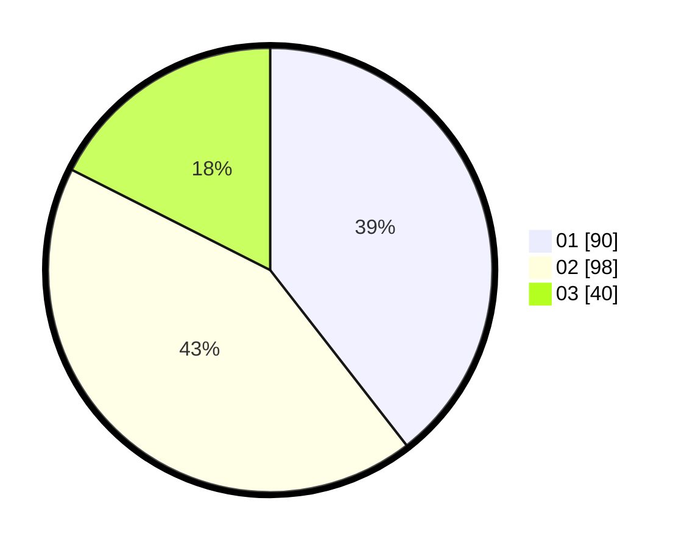

# Hasil

Hasil perolehan suara paslon dapat dilihat pada file paslon-01.txt, paslon-02.txt, dan paslon-03.txt.

Jika tidak ada, artinya data tersebut belum ada pada SIREKAP.

## Perolehan Suara

 * Paslon 01: **90**.
 * Paslon 02: **98**.
 * Paslon 03: **40**.

## Foto C Plano

https://sirekap-obj-formc.kpu.go.id/467f/pemilu/ppwp/31/74/07/10/09/3174071009030-20240219-123845--64719f0f-63f2-4183-b817-c5b28b4d3b3c.jpg

https://sirekap-obj-formc.kpu.go.id/467f/pemilu/ppwp/31/74/07/10/09/3174071009030-20240219-123806--d52d6cfe-1319-4fd2-977a-badb565b2c8c.jpg

https://sirekap-obj-formc.kpu.go.id/467f/pemilu/ppwp/31/74/07/10/09/3174071009030-20240219-123830--3dc4239c-d16a-424f-ba28-0dba7762039b.jpg

## DATA PEMILIH TETAP

Jumlah pemilih dalam DPT: **280**.
 * L: **39**.
 * P: **450**.

## DATA PENGGUNA HAK PILIH

Jumlah pengguna hak pilih dalam DPT: **232**.
 * L: **400**.
 * P: **433**.

Jumlah pengguna hak pilih dalam DPTb: **885**.
 * L: **884**.
 * P: **886**.

Jumlah pengguna hak pilih dalam DPK: **888**.
 * L: **888**.
 * P: **88**.

Jumlah pengguna hak pilih: **232**.
 * L: **494**.
 * P: **428**.

## JUMLAH SUARA SAH DAN TIDAK SAH

JUMLAH SELURUH SUARA SAH: **329**.

JUMLAH SUARA TIDAK SAH: **883**.

JUMLAH SELURUH SUARA SAH DAN SUARA TIDAK SAH: **332**.
