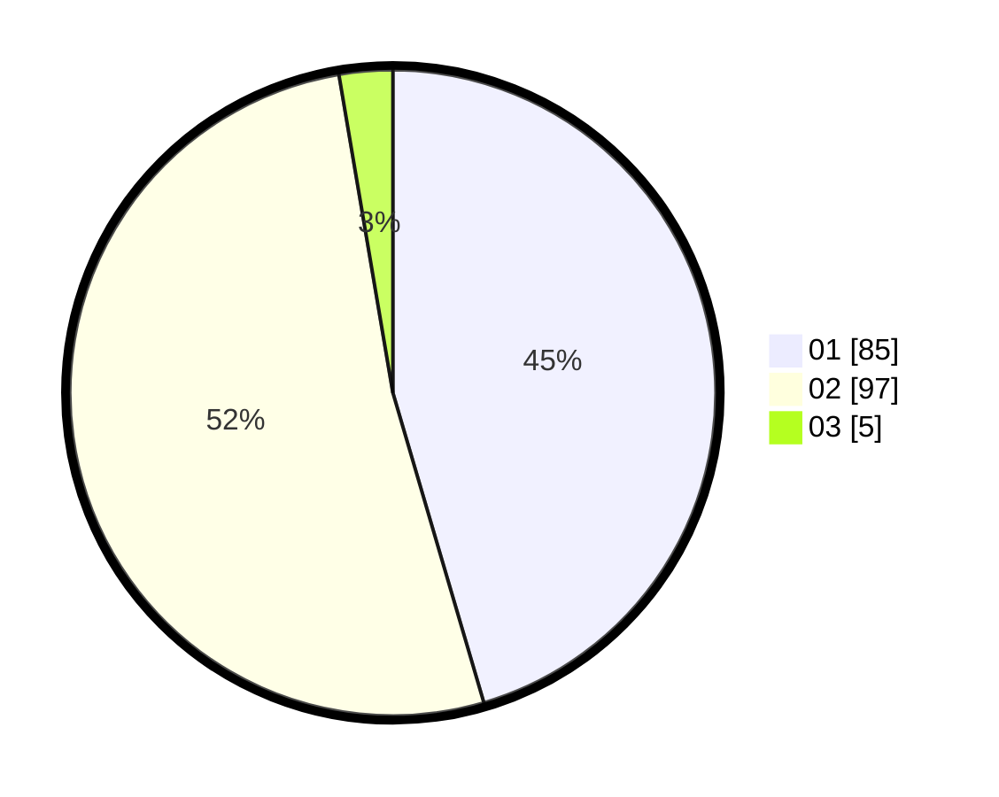

# Hasil

Hasil perolehan suara paslon dapat dilihat pada file paslon-01.txt, paslon-02.txt, dan paslon-03.txt.

Jika tidak ada, artinya data tersebut belum ada pada SIREKAP.

## Perolehan Suara

 * Paslon 01: **85**.
 * Paslon 02: **97**.
 * Paslon 03: **5**.

## Foto C Plano

https://sirekap-obj-formc.kpu.go.id/22ff/pemilu/ppwp/31/74/07/10/09/3174071009033-20240219-154227--de70d534-6668-4f81-9105-2b698da5e7e3.jpg

https://sirekap-obj-formc.kpu.go.id/22ff/pemilu/ppwp/31/74/07/10/09/3174071009033-20240219-154304--00a30fd5-db2c-429c-be8f-b69bc87f14d9.jpg

https://sirekap-obj-formc.kpu.go.id/22ff/pemilu/ppwp/31/74/07/10/09/3174071009033-20240219-154400--ca0feac5-2a33-47f2-9e10-e3459c7005a1.jpg

## DATA PEMILIH TETAP

Jumlah pemilih dalam DPT: **263**.
 * L: **122**.
 * P: **441**.

## DATA PENGGUNA HAK PILIH

Jumlah pengguna hak pilih dalam DPT: **220**.
 * L: **700**.
 * P: **720**.

Jumlah pengguna hak pilih dalam DPTb: **8**.
 * L: **6**.
 * P: **2**.

Jumlah pengguna hak pilih dalam DPK: **0**.
 * L: **0**.
 * P: **0**.

Jumlah pengguna hak pilih: **228**.
 * L: **106**.
 * P: **122**.

## JUMLAH SUARA SAH DAN TIDAK SAH

JUMLAH SELURUH SUARA SAH: **227**.

JUMLAH SUARA TIDAK SAH: **1**.

JUMLAH SELURUH SUARA SAH DAN SUARA TIDAK SAH: **228**.
