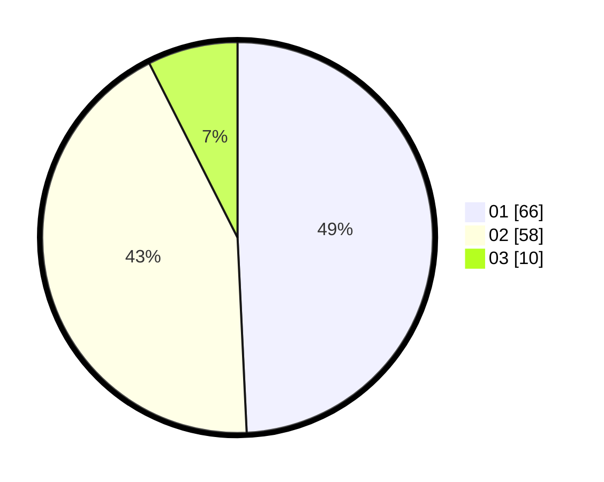

# Hasil

Hasil perolehan suara paslon dapat dilihat pada file paslon-01.txt, paslon-02.txt, dan paslon-03.txt.

Jika tidak ada, artinya data tersebut belum ada pada SIREKAP.

## Perolehan Suara

 * Paslon 01: **66**.
 * Paslon 02: **58**.
 * Paslon 03: **10**.

## Foto C Plano

https://sirekap-obj-formc.kpu.go.id/288c/pemilu/ppwp/31/74/07/10/09/3174071009034-20240219-161744--eb00423e-3e2a-4f71-be10-da00bdbbf176.jpg

https://sirekap-obj-formc.kpu.go.id/288c/pemilu/ppwp/31/74/07/10/09/3174071009034-20240219-161904--b700a351-5c99-4f43-ba6d-04776abb38c3.jpg

https://sirekap-obj-formc.kpu.go.id/288c/pemilu/ppwp/31/74/07/10/09/3174071009034-20240219-161835--a2531554-ec9c-456d-9753-8abb75a9bff2.jpg

## DATA PEMILIH TETAP

Jumlah pemilih dalam DPT: **386**.
 * L: **309**.
 * P: **882**.

## DATA PENGGUNA HAK PILIH

Jumlah pengguna hak pilih dalam DPT: **5**.
 * L: **556**.
 * P: **656**.

Jumlah pengguna hak pilih dalam DPTb: **884**.
 * L: **882**.
 * P: **882**.

Jumlah pengguna hak pilih dalam DPK: **885**.
 * L: **882**.
 * P: **883**.

Jumlah pengguna hak pilih: **434**.
 * L: **824**.
 * P: **860**.

## JUMLAH SUARA SAH DAN TIDAK SAH

JUMLAH SELURUH SUARA SAH: **434**.

JUMLAH SUARA TIDAK SAH: **888**.

JUMLAH SELURUH SUARA SAH DAN SUARA TIDAK SAH: **888**.
