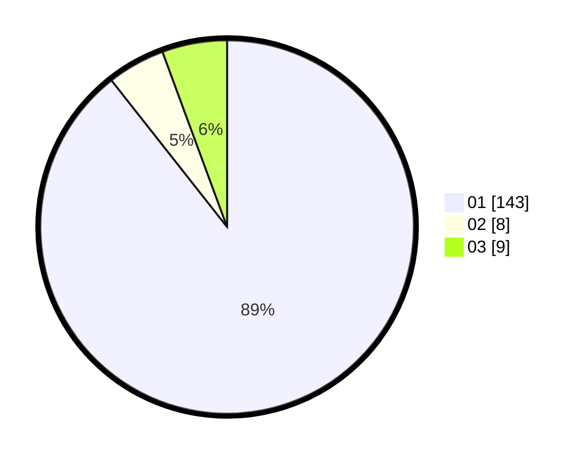

# Hasil

Hasil perolehan suara paslon dapat dilihat pada file paslon-01.txt, paslon-02.txt, dan paslon-03.txt.

Jika tidak ada, artinya data tersebut belum ada pada SIREKAP.

## Perolehan Suara

 * Paslon 01: **143**.
 * Paslon 02: **8**.
 * Paslon 03: **9**.

## Foto C Plano

https://sirekap-obj-formc.kpu.go.id/47b1/pemilu/ppwp/31/74/07/10/09/3174071009040-20240219-192930--ed97082d-2d4c-4277-8011-f8aeea0c2e72.jpg

https://sirekap-obj-formc.kpu.go.id/47b1/pemilu/ppwp/31/74/07/10/09/3174071009040-20240219-193006--828e10a7-5000-47a5-9c06-9b3a40a02438.jpg

https://sirekap-obj-formc.kpu.go.id/47b1/pemilu/ppwp/31/74/07/10/09/3174071009040-20240219-193026--72c257ab-de73-4fc3-b808-c911aee430f4.jpg

## DATA PEMILIH TETAP

Jumlah pemilih dalam DPT: **275**.
 * L: **337**.
 * P: **538**.

## DATA PENGGUNA HAK PILIH

Jumlah pengguna hak pilih dalam DPT: **333**.
 * L: **828**.
 * P: **33**.

Jumlah pengguna hak pilih dalam DPTb: **883**.
 * L: **883**.
 * P: **888**.

Jumlah pengguna hak pilih dalam DPK: **882**.
 * L: **882**.
 * P: **888**.

Jumlah pengguna hak pilih: **234**.
 * L: **222**.
 * P: **22**.

## JUMLAH SUARA SAH DAN TIDAK SAH

JUMLAH SELURUH SUARA SAH: **234**.

JUMLAH SUARA TIDAK SAH: **883**.

JUMLAH SELURUH SUARA SAH DAN SUARA TIDAK SAH: **234**.
