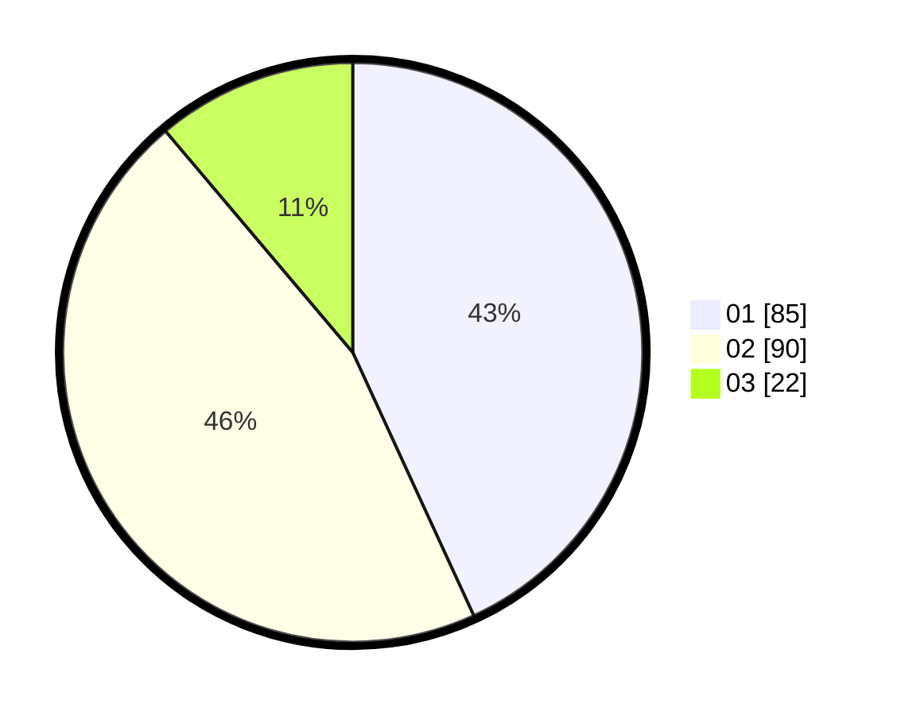

# Hasil

Hasil perolehan suara paslon dapat dilihat pada file paslon-01.txt, paslon-02.txt, dan paslon-03.txt.

Jika tidak ada, artinya data tersebut belum ada pada SIREKAP.

## Perolehan Suara

 * Paslon 01: **85**.
 * Paslon 02: **90**.
 * Paslon 03: **22**.

## Foto C Plano

https://sirekap-obj-formc.kpu.go.id/f536/pemilu/ppwp/31/74/07/10/09/3174071009059-20240215-024603--f5d54574-f018-4375-8b65-f2152f5aee5b.jpg

https://sirekap-obj-formc.kpu.go.id/f536/pemilu/ppwp/31/74/07/10/09/3174071009059-20240215-033414--d9242efc-5c91-4889-9d4c-effd221c56a5.jpg

https://sirekap-obj-formc.kpu.go.id/f536/pemilu/ppwp/31/74/07/10/09/3174071009059-20240215-024753--8c8030b7-7f88-46fe-a6f8-3dafc16f7490.jpg
