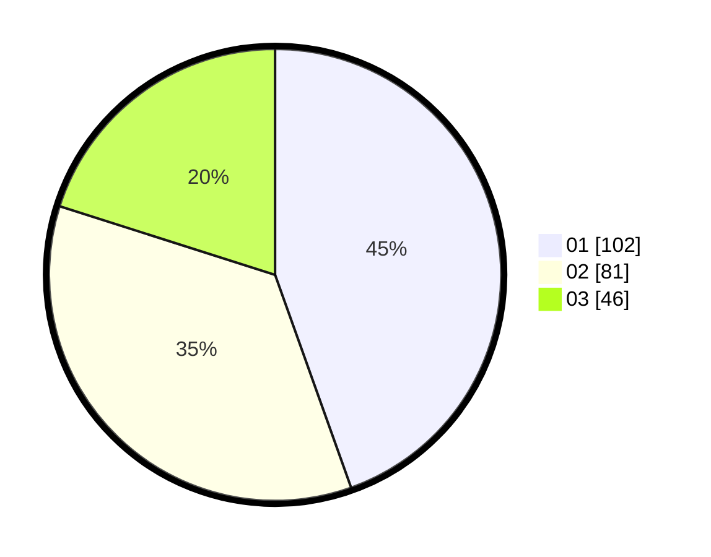

# Hasil

Hasil perolehan suara paslon dapat dilihat pada file paslon-01.txt, paslon-02.txt, dan paslon-03.txt.

Jika tidak ada, artinya data tersebut belum ada pada SIREKAP.

## Perolehan Suara

 * Paslon 01: **102**.
 * Paslon 02: **81**.
 * Paslon 03: **46**.

## Foto C Plano

https://sirekap-obj-formc.kpu.go.id/4229/pemilu/ppwp/31/74/07/10/09/3174071009064-20240215-123338--7371cb23-fa5a-4dde-8e4c-c6ad66f8d08d.jpg

https://sirekap-obj-formc.kpu.go.id/4229/pemilu/ppwp/31/74/07/10/09/3174071009064-20240215-123348--8b09049c-0f98-468e-89c4-fb25bc20e959.jpg

https://sirekap-obj-formc.kpu.go.id/4229/pemilu/ppwp/31/74/07/10/09/3174071009064-20240214-190915--121bff9e-c55e-4760-9cce-90160053b934.jpg

## DATA PEMILIH TETAP

Jumlah pemilih dalam DPT: **286**.
 * L: **146**.
 * P: **140**.

## DATA PENGGUNA HAK PILIH

Jumlah pengguna hak pilih dalam DPT: **214**.
 * L: **108**.
 * P: **106**.

Jumlah pengguna hak pilih dalam DPTb: **12**.
 * L: **6**.
 * P: **6**.

Jumlah pengguna hak pilih dalam DPK: **3**.
 * L: **2**.
 * P: **1**.

Jumlah pengguna hak pilih: **229**.
 * L: **116**.
 * P: **113**.

## JUMLAH SUARA SAH DAN TIDAK SAH

JUMLAH SELURUH SUARA SAH: **229**.

JUMLAH SUARA TIDAK SAH: **0**.

JUMLAH SELURUH SUARA SAH DAN SUARA TIDAK SAH: **229**.
