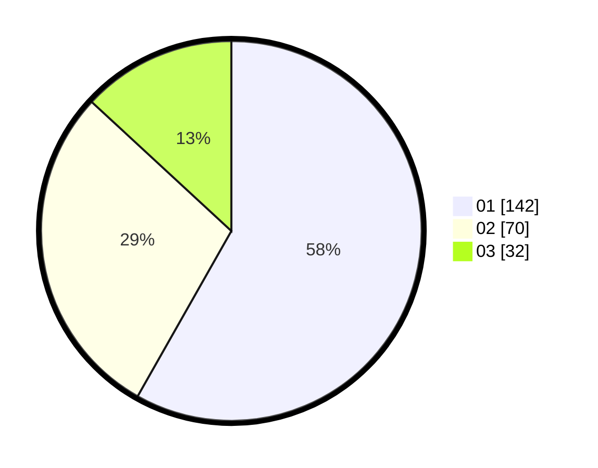

# Hasil

Hasil perolehan suara paslon dapat dilihat pada file paslon-01.txt, paslon-02.txt, dan paslon-03.txt.

Jika tidak ada, artinya data tersebut belum ada pada SIREKAP.

## Perolehan Suara

 * Paslon 01: **142**.
 * Paslon 02: **70**.
 * Paslon 03: **32**.

## Foto C Plano

https://sirekap-obj-formc.kpu.go.id/d9b1/pemilu/ppwp/31/74/07/10/09/3174071009075-20240216-135934--da4b25dc-189d-49ba-91dd-fe404c1c29ca.jpg

https://sirekap-obj-formc.kpu.go.id/d9b1/pemilu/ppwp/31/74/07/10/09/3174071009075-20240216-135935--ed331352-c95d-4ae2-b1cc-1f6ef0914fd4.jpg

https://sirekap-obj-formc.kpu.go.id/d9b1/pemilu/ppwp/31/74/07/10/09/3174071009075-20240216-135934--3e275f5e-67b9-4149-b7e8-6fa6c612de03.jpg

## DATA PEMILIH TETAP

Jumlah pemilih dalam DPT: **298**.
 * L: **146**.
 * P: **152**.

## DATA PENGGUNA HAK PILIH

Jumlah pengguna hak pilih dalam DPT: **234**.
 * L: **109**.
 * P: **125**.

Jumlah pengguna hak pilih dalam DPTb: **8**.
 * L: **2**.
 * P: **6**.

Jumlah pengguna hak pilih dalam DPK: **2**.
 * L: **1**.
 * P: **1**.

Jumlah pengguna hak pilih: **244**.
 * L: **112**.
 * P: **132**.

## JUMLAH SUARA SAH DAN TIDAK SAH

JUMLAH SELURUH SUARA SAH: **244**.

JUMLAH SUARA TIDAK SAH: **0**.

JUMLAH SELURUH SUARA SAH DAN SUARA TIDAK SAH: **244**.
