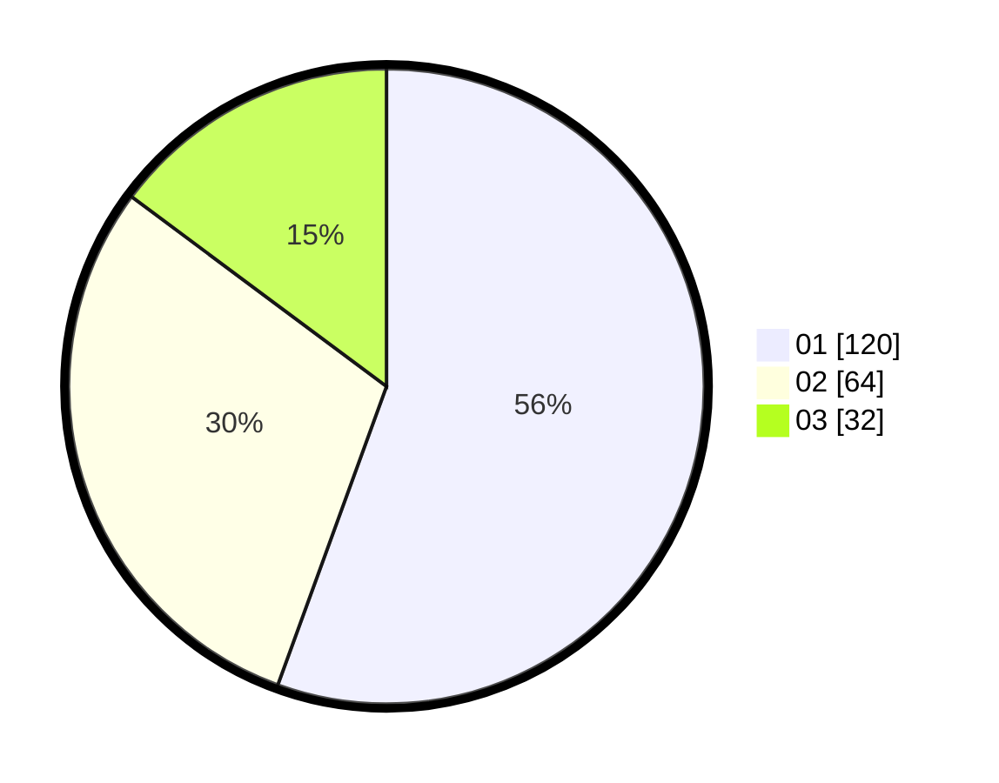

# Hasil

Hasil perolehan suara paslon dapat dilihat pada file paslon-01.txt, paslon-02.txt, dan paslon-03.txt.

Jika tidak ada, artinya data tersebut belum ada pada SIREKAP.

## Perolehan Suara

 * Paslon 01: **120**.
 * Paslon 02: **64**.
 * Paslon 03: **32**.

## Foto C Plano

https://sirekap-obj-formc.kpu.go.id/88c5/pemilu/ppwp/31/74/07/10/09/3174071009135-20240215-233452--138c924d-39bc-49f2-bc27-ba9deacb10b8.jpg

https://sirekap-obj-formc.kpu.go.id/88c5/pemilu/ppwp/31/74/07/10/09/3174071009135-20240215-233454--45dc9bb7-8688-4281-bbc6-7e88c18385cf.jpg

https://sirekap-obj-formc.kpu.go.id/88c5/pemilu/ppwp/31/74/07/10/09/3174071009135-20240215-233453--4159bb70-ccb3-4971-b9ec-32ca9f69ccdc.jpg

## DATA PEMILIH TETAP

Jumlah pemilih dalam DPT: **0**.
 * L: **0**.
 * P: **0**.

## DATA PENGGUNA HAK PILIH

Jumlah pengguna hak pilih dalam DPT: **0**.
 * L: **0**.
 * P: **0**.

Jumlah pengguna hak pilih dalam DPTb: **0**.
 * L: **0**.
 * P: **0**.

Jumlah pengguna hak pilih dalam DPK: **0**.
 * L: **0**.
 * P: **0**.

Jumlah pengguna hak pilih: **0**.
 * L: **0**.
 * P: **0**.

## JUMLAH SUARA SAH DAN TIDAK SAH

JUMLAH SELURUH SUARA SAH: **216**.

JUMLAH SUARA TIDAK SAH: **4**.

JUMLAH SELURUH SUARA SAH DAN SUARA TIDAK SAH: **220**.
