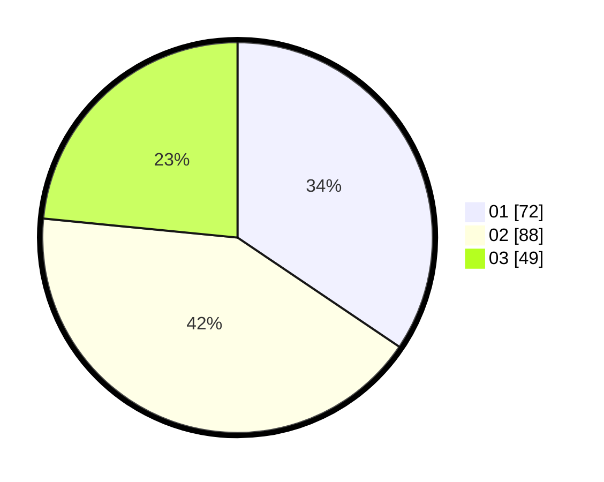

# Hasil

Hasil perolehan suara paslon dapat dilihat pada file paslon-01.txt, paslon-02.txt, dan paslon-03.txt.

Jika tidak ada, artinya data tersebut belum ada pada SIREKAP.

## Perolehan Suara

 * Paslon 01: **72**.
 * Paslon 02: **88**.
 * Paslon 03: **49**.

## Foto C Plano

https://sirekap-obj-formc.kpu.go.id/dded/pemilu/ppwp/31/74/07/10/10/3174071010002-20240215-122353--3b0b0d36-8e65-46cb-b475-b20d89bd633c.jpg

https://sirekap-obj-formc.kpu.go.id/dded/pemilu/ppwp/31/74/07/10/10/3174071010002-20240215-122357--dc1bb67c-6a5a-497e-a8a1-c5e7cb34915d.jpg

https://sirekap-obj-formc.kpu.go.id/dded/pemilu/ppwp/31/74/07/10/10/3174071010002-20240216-212628--230bfea5-6bf7-473f-8e2b-80fb2f10c5db.jpg

## DATA PEMILIH TETAP

Jumlah pemilih dalam DPT: **261**.
 * L: **129**.
 * P: **132**.

## DATA PENGGUNA HAK PILIH

Jumlah pengguna hak pilih dalam DPT: **203**.
 * L: **100**.
 * P: **103**.

Jumlah pengguna hak pilih dalam DPTb: **6**.
 * L: **0**.
 * P: **6**.

Jumlah pengguna hak pilih dalam DPK: **0**.
 * L: **0**.
 * P: **0**.

Jumlah pengguna hak pilih: **209**.
 * L: **100**.
 * P: **109**.

## JUMLAH SUARA SAH DAN TIDAK SAH

JUMLAH SELURUH SUARA SAH: **209**.

JUMLAH SUARA TIDAK SAH: **4**.

JUMLAH SELURUH SUARA SAH DAN SUARA TIDAK SAH: **213**.
