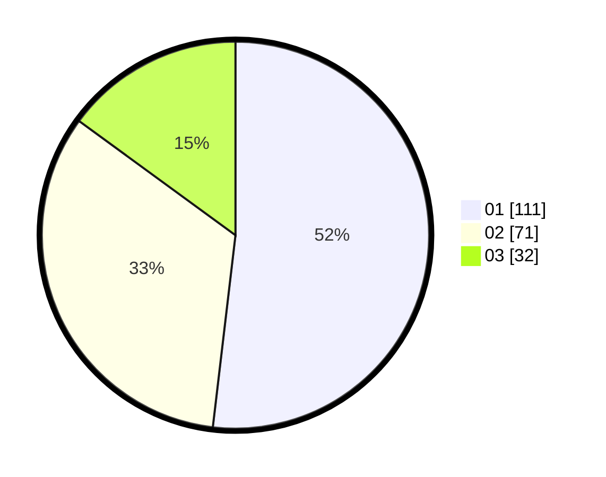

# Hasil

Hasil perolehan suara paslon dapat dilihat pada file paslon-01.txt, paslon-02.txt, dan paslon-03.txt.

Jika tidak ada, artinya data tersebut belum ada pada SIREKAP.

## Perolehan Suara

 * Paslon 01: **111**.
 * Paslon 02: **71**.
 * Paslon 03: **32**.

## Foto C Plano

https://sirekap-obj-formc.kpu.go.id/ff51/pemilu/ppwp/31/74/07/10/10/3174071010003-20240217-134539--47601fe3-b75f-4c56-b671-35d5b689689b.jpg

https://sirekap-obj-formc.kpu.go.id/ff51/pemilu/ppwp/31/74/07/10/10/3174071010003-20240217-134616--91a86550-9caa-473a-8827-e978c38924c3.jpg

https://sirekap-obj-formc.kpu.go.id/ff51/pemilu/ppwp/31/74/07/10/10/3174071010003-20240217-134638--108f78c5-af61-4d3d-99e3-1f4230235d75.jpg

## DATA PEMILIH TETAP

Jumlah pemilih dalam DPT: **276**.
 * L: **139**.
 * P: **137**.

## DATA PENGGUNA HAK PILIH

Jumlah pengguna hak pilih dalam DPT: **211**.
 * L: **104**.
 * P: **107**.

Jumlah pengguna hak pilih dalam DPTb: **5**.
 * L: **1**.
 * P: **4**.

Jumlah pengguna hak pilih dalam DPK: **3**.
 * L: **1**.
 * P: **2**.

Jumlah pengguna hak pilih: **219**.
 * L: **106**.
 * P: **113**.

## JUMLAH SUARA SAH DAN TIDAK SAH

JUMLAH SELURUH SUARA SAH: **214**.

JUMLAH SUARA TIDAK SAH: **5**.

JUMLAH SELURUH SUARA SAH DAN SUARA TIDAK SAH: **219**.
