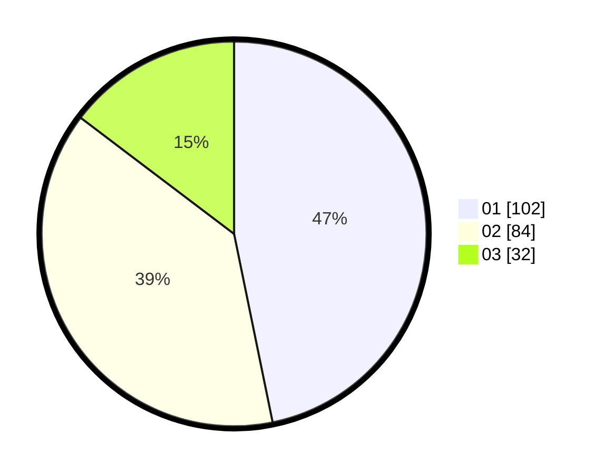

# Hasil

Hasil perolehan suara paslon dapat dilihat pada file paslon-01.txt, paslon-02.txt, dan paslon-03.txt.

Jika tidak ada, artinya data tersebut belum ada pada SIREKAP.

## Perolehan Suara

 * Paslon 01: **102**.
 * Paslon 02: **84**.
 * Paslon 03: **32**.

## Foto C Plano

https://sirekap-obj-formc.kpu.go.id/73f2/pemilu/ppwp/31/74/07/10/10/3174071010006-20240219-113422--2982bd12-6109-46e0-96d6-49bc25931603.jpg

https://sirekap-obj-formc.kpu.go.id/73f2/pemilu/ppwp/31/74/07/10/10/3174071010006-20240219-113832--752af915-6511-4c8d-a240-ea4bf8866354.jpg

https://sirekap-obj-formc.kpu.go.id/73f2/pemilu/ppwp/31/74/07/10/10/3174071010006-20240219-113942--275046b9-877a-4c1c-81be-3c86afee5570.jpg

## DATA PEMILIH TETAP

Jumlah pemilih dalam DPT: **264**.
 * L: **128**.
 * P: **136**.

## DATA PENGGUNA HAK PILIH

Jumlah pengguna hak pilih dalam DPT: **213**.
 * L: **108**.
 * P: **105**.

Jumlah pengguna hak pilih dalam DPTb: **4**.
 * L: **2**.
 * P: **2**.

Jumlah pengguna hak pilih dalam DPK: **1**.
 * L: **1**.
 * P: **0**.

Jumlah pengguna hak pilih: **218**.
 * L: **111**.
 * P: **107**.

## JUMLAH SUARA SAH DAN TIDAK SAH

JUMLAH SELURUH SUARA SAH: **218**.

JUMLAH SUARA TIDAK SAH: **0**.

JUMLAH SELURUH SUARA SAH DAN SUARA TIDAK SAH: **218**.
