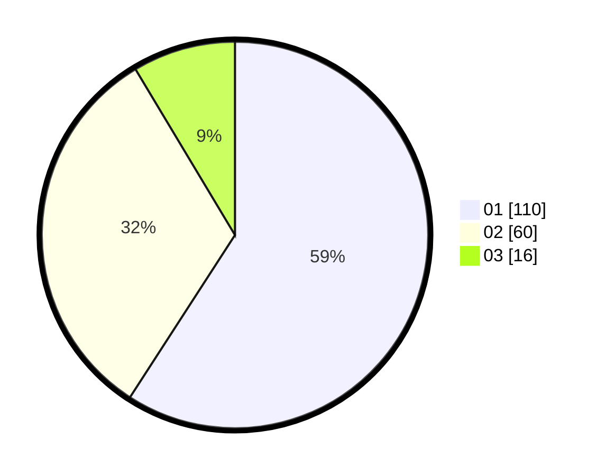

# Hasil

Hasil perolehan suara paslon dapat dilihat pada file paslon-01.txt, paslon-02.txt, dan paslon-03.txt.

Jika tidak ada, artinya data tersebut belum ada pada SIREKAP.

## Perolehan Suara

 * Paslon 01: **110**.
 * Paslon 02: **60**.
 * Paslon 03: **16**.

## Foto C Plano

https://sirekap-obj-formc.kpu.go.id/377d/pemilu/ppwp/31/74/07/10/10/3174071010008-20240219-110554--fbcad59b-a34f-4912-af4d-7e04ba87432b.jpg

https://sirekap-obj-formc.kpu.go.id/377d/pemilu/ppwp/31/74/07/10/10/3174071010008-20240219-110847--e255581a-ac34-4191-9d16-020764a5435c.jpg

https://sirekap-obj-formc.kpu.go.id/377d/pemilu/ppwp/31/74/07/10/10/3174071010008-20240219-111024--b899a7f9-5e7f-489a-887d-cb1cc5f6a303.jpg

## DATA PEMILIH TETAP

Jumlah pemilih dalam DPT: **251**.
 * L: **129**.
 * P: **122**.

## DATA PENGGUNA HAK PILIH

Jumlah pengguna hak pilih dalam DPT: **186**.
 * L: **100**.
 * P: **86**.

Jumlah pengguna hak pilih dalam DPTb: **0**.
 * L: **0**.
 * P: **0**.

Jumlah pengguna hak pilih dalam DPK: **1**.
 * L: **0**.
 * P: **1**.

Jumlah pengguna hak pilih: **187**.
 * L: **100**.
 * P: **87**.

## JUMLAH SUARA SAH DAN TIDAK SAH

JUMLAH SELURUH SUARA SAH: **186**.

JUMLAH SUARA TIDAK SAH: **1**.

JUMLAH SELURUH SUARA SAH DAN SUARA TIDAK SAH: **187**.
