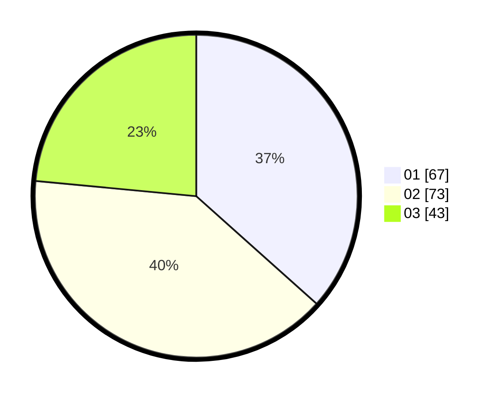

# Hasil

Hasil perolehan suara paslon dapat dilihat pada file paslon-01.txt, paslon-02.txt, dan paslon-03.txt.

Jika tidak ada, artinya data tersebut belum ada pada SIREKAP.

## Perolehan Suara

 * Paslon 01: **67**.
 * Paslon 02: **73**.
 * Paslon 03: **43**.

## Foto C Plano

https://sirekap-obj-formc.kpu.go.id/f7c3/pemilu/ppwp/31/74/07/10/10/3174071010009-20240219-164317--e27a3a24-77fa-4e35-a8c0-a81ec0f10833.jpg

https://sirekap-obj-formc.kpu.go.id/f7c3/pemilu/ppwp/31/74/07/10/10/3174071010009-20240214-215001--0d514a5f-9dd4-429a-80ac-9983d7b67e1f.jpg

https://sirekap-obj-formc.kpu.go.id/f7c3/pemilu/ppwp/31/74/07/10/10/3174071010009-20240219-164635--922638ce-8054-43a9-ad3a-34741abea38e.jpg
