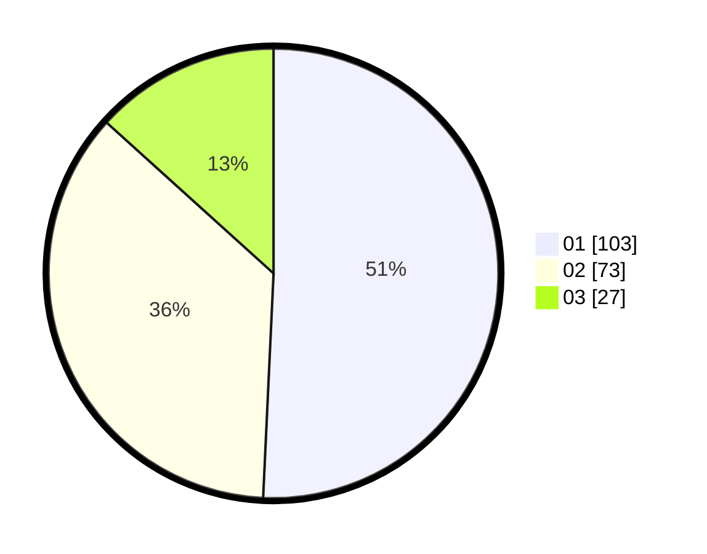

# Hasil

Hasil perolehan suara paslon dapat dilihat pada file paslon-01.txt, paslon-02.txt, dan paslon-03.txt.

Jika tidak ada, artinya data tersebut belum ada pada SIREKAP.

## Perolehan Suara

 * Paslon 01: **103**.
 * Paslon 02: **73**.
 * Paslon 03: **27**.

## Foto C Plano

https://sirekap-obj-formc.kpu.go.id/d867/pemilu/ppwp/31/74/07/10/10/3174071010013-20240214-155549--6f157ef0-18f2-42d2-a690-f9ca7927a96d.jpg

https://sirekap-obj-formc.kpu.go.id/d867/pemilu/ppwp/31/74/07/10/10/3174071010013-20240214-155500--a8ff77f1-f05d-4ac1-8b95-b1a3d9b9bbba.jpg

https://sirekap-obj-formc.kpu.go.id/d867/pemilu/ppwp/31/74/07/10/10/3174071010013-20240214-155637--616446a6-3677-4ad9-a41e-19669e5156af.jpg

## DATA PEMILIH TETAP

Jumlah pemilih dalam DPT: **190**.
 * L: **95**.
 * P: **95**.

## DATA PENGGUNA HAK PILIH

Jumlah pengguna hak pilih dalam DPT: **190**.
 * L: **95**.
 * P: **95**.

Jumlah pengguna hak pilih dalam DPTb: **0**.
 * L: **0**.
 * P: **0**.

Jumlah pengguna hak pilih dalam DPK: **16**.
 * L: **8**.
 * P: **8**.

Jumlah pengguna hak pilih: **206**.
 * L: **0**.
 * P: **0**.

## JUMLAH SUARA SAH DAN TIDAK SAH

JUMLAH SELURUH SUARA SAH: **203**.

JUMLAH SUARA TIDAK SAH: **3**.

JUMLAH SELURUH SUARA SAH DAN SUARA TIDAK SAH: **206**.
